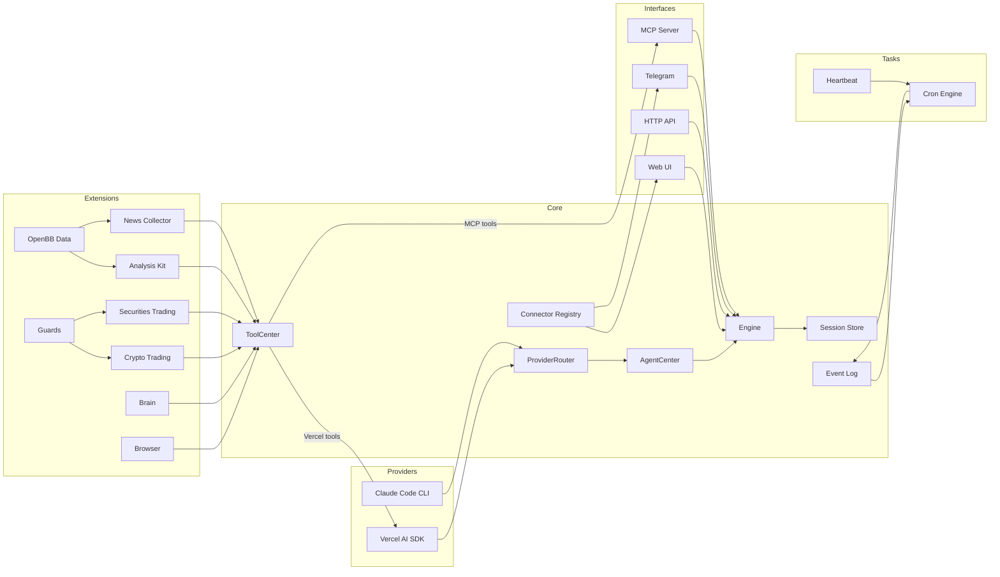

<p align="center">
  
</p>

<p align="center">
  <a href="https://deepwiki.com/TraderAlice/OpenAlice"></a> · <a href="https://traderalice.com"></a>
</p>

# Open Alice

Your one-person Wall Street. Alice is an AI trading agent that gives you your own research desk, quant team, trading floor, and risk management — all running on your laptop 24/7.

- **File-driven** — Markdown defines persona and tasks, JSON defines config, JSONL stores conversations. Both humans and AI control Alice by reading and modifying files. The same read/write primitives that power vibe coding transfer directly to vibe trading. No database, no containers, just files.
- **Reasoning-driven** — every trading decision is based on continuous reasoning and signal mixing.
- **OS-native** — Alice can interact with your operating system. Search the web through your browser, send messages via Telegram, and connect to local devices.

## Features

- **Dual AI provider** — switch between Claude Code CLI and Vercel AI SDK at runtime, no restart needed
- **Crypto trading** — CCXT-based execution (Bybit, OKX, Binance, etc.) with a git-like wallet (stage, commit, push)
- **Securities trading** — Alpaca integration for US equities with the same wallet workflow
- **Guard pipeline** — extensible pre-execution safety checks for both crypto and securities (max position size, max leverage, cooldown between trades)
- **Market data** — OpenBB-powered equity, crypto, commodity, and currency data layers with symbol search and technical indicator calculator
- **Equity research** — company profiles, financial statements, ratios, analyst estimates, earnings calendar, insider trading, and market movers (top gainers, losers, most active)
- **News collector** — background RSS collection from configurable feeds with archive search tools (`globNews`/`grepNews`/`readNews`). Also captures OpenBB news API results via piggyback
- **Cognitive state** — persistent "brain" with frontal lobe memory, emotion tracking, and commit history
- **Event log** — persistent append-only JSONL event log with real-time subscriptions and crash recovery
- **Cron scheduling** — event-driven cron system with AI-powered job execution and automatic delivery to the last-interacted channel
- **Evolution mode** — two-tier permission system. Normal mode sandboxes the AI to `data/brain/`; evolution mode gives full project access including Bash, enabling the agent to modify its own source code
- **Hot-reload** — enable/disable connectors (Telegram, MCP Ask) and reconnect trading engines at runtime without restart
- **Web UI** — local chat interface with portfolio dashboard and full config management (trading, data sources, connectors, settings)

## Key Concepts

**Provider** — The AI backend that powers Alice. Claude Code (subprocess) or Vercel AI SDK (in-process). Switchable at runtime via `ai-provider.json`.

**Extension** — A self-contained tool package registered in ToolCenter. Each extension owns its tools, state, and persistence. Examples: crypto-trading, brain, analysis-kit.

**Wallet** — A git-like workflow for trading operations. You stage orders, commit with a message, then push to execute. Every commit gets an 8-char hash. Full history is reviewable via `walletLog` / `walletShow`.

**Guard** — A pre-execution check that runs before every trading operation reaches the exchange. Guards enforce limits (max position size, max leverage, cooldown between trades) and can be configured per-asset.

**Connector** — An external interface through which users interact with Alice. Built-in: Web UI, Telegram, MCP Ask. Connectors register with the ConnectorRegistry; delivery always goes to the channel of last interaction.

**Brain** — Alice's persistent cognitive state. The frontal lobe stores working memory across rounds; emotion tracking logs sentiment shifts with rationale. Both are versioned as commits.

**Heartbeat** — A periodic check-in where Alice reviews market conditions and decides whether to send you a message. Uses a structured protocol: `HEARTBEAT_OK` (nothing to report), `CHAT_YES` (has something to say), `CHAT_NO` (quiet).

**EventLog** — A persistent append-only JSONL event bus. Cron fires, heartbeat results, and errors all flow through here. Supports real-time subscriptions and crash recovery.

**Evolution Mode** — A permission escalation toggle. Off: Alice can only read/write `data/brain/`. On: full project access including Bash — Alice can modify her own source code.

## Architecture



**Providers** — interchangeable AI backends. Claude Code spawns `claude -p` as a subprocess; Vercel AI SDK runs a `ToolLoopAgent` in-process. `ProviderRouter` reads `ai-provider.json` on each call to select the active backend at runtime.

**Core** — `Engine` is a thin facade that delegates to `AgentCenter`, which routes all calls (both stateless and session-aware) through `ProviderRouter`. `ToolCenter` is a centralized tool registry — extensions register tools there, and it exports them in Vercel AI SDK and MCP formats. `EventLog` provides persistent append-only event storage (JSONL) with real-time subscriptions and crash recovery. `ConnectorRegistry` tracks which channel the user last spoke through.

**Extensions** — domain-specific tool sets registered in `ToolCenter`. Each extension owns its tools, state, and persistence. `Guards` enforce pre-execution safety checks (position size limits, leverage caps, trade cooldowns) on both crypto and securities operations. `NewsCollector` runs background RSS fetches and piggybacks OpenBB news calls into a persistent archive searchable by the agent.

**Tasks** — scheduled background work. `CronEngine` manages jobs and fires `cron.fire` events into the EventLog on schedule; a listener picks them up, runs them through the AI engine, and delivers replies via the ConnectorRegistry. `Heartbeat` is a periodic health-check that uses a structured response protocol (HEARTBEAT_OK / CHAT_NO / CHAT_YES).

**Interfaces** — external surfaces. Web UI for local chat, Telegram bot for mobile, HTTP for webhooks, MCP server for tool exposure. External agents can also [converse with Alice via a separate MCP endpoint](docs/mcp-ask-connector.md).

## Quick Start

Prerequisites: Node.js 22+, pnpm 10+, [Claude Code CLI](https://docs.anthropic.com/en/docs/claude-code) installed and authenticated.

```bash
git clone https://github.com/TraderAlice/OpenAlice.git
cd OpenAlice
pnpm install && pnpm build
pnpm dev
```

Open [localhost:3002](http://localhost:3002) and start chatting. No API keys or config needed — the default setup uses Claude Code as the AI backend with your existing login.

```bash
pnpm dev        # start backend (port 3002) with watch mode
pnpm dev:ui     # start frontend dev server (port 5173) with hot reload
pnpm build      # production build (backend + UI)
pnpm test       # run tests
```

> **Note:** Port 3002 serves the UI only after `pnpm build`. For frontend development, use `pnpm dev:ui` (port 5173) which proxies to the backend and provides hot reload.

## Configuration

All config lives in `data/config/` as JSON files with Zod validation. Missing files fall back to sensible defaults. You can edit these files directly or use the Web UI.

**AI Provider** — The default provider is Claude Code (`claude -p` subprocess). To use the [Vercel AI SDK](https://sdk.vercel.ai/docs) instead (Anthropic, OpenAI, Google, etc.), switch `ai-provider.json` to `vercel-ai-sdk` and add your API key to `api-keys.json`.

**Crypto Trading** — Powered by [CCXT](https://docs.ccxt.com/). Configure exchange and API keys in `crypto.json`. Any CCXT-supported exchange works (Bybit, OKX, Binance, etc.).

**Securities Trading** — Powered by [Alpaca](https://alpaca.markets/). Configure broker and API keys in `securities.json`. Supports paper and live trading.

| File | Purpose |
|------|---------|
| `engine.json` | Trading pairs, tick interval, timeframe |
| `model.json` | AI model provider and model name |
| `agent.json` | Max agent steps, evolution mode toggle, Claude Code tool permissions |
| `ai-provider.json` | Active AI provider (`vercel-ai-sdk` or `claude-code`), switchable at runtime |
| `api-keys.json` | AI provider API keys (Anthropic, OpenAI, Google) — only needed for Vercel AI SDK mode |
| `crypto.json` | Allowed symbols, CCXT exchange config + API keys, demo trading flag, guards |
| `securities.json` | Allowed symbols, Alpaca broker config + API keys, paper trading flag, guards |
| `connectors.json` | Web/MCP server ports, Telegram bot credentials + enable, MCP Ask enable |
| `openbb.json` | OpenBB API URL, per-asset-class data providers, provider API keys |
| `news-collector.json` | RSS feeds, fetch interval, retention period, OpenBB piggyback toggle |
| `compaction.json` | Context window limits, auto-compaction thresholds |
| `heartbeat.json` | Heartbeat enable/disable, interval, active hours |

Persona and heartbeat prompts use a **default + user override** pattern:

| Default (git-tracked) | User override (gitignored) |
|------------------------|---------------------------|
| `data/default/persona.default.md` | `data/brain/persona.md` |
| `data/default/heartbeat.default.md` | `data/brain/heartbeat.md` |

On first run, defaults are auto-copied to the user override path. Edit the user files to customize without touching version control.

## Project Structure

```
src/
  main.ts                    # Composition root — wires everything together
  core/
    engine.ts                # Thin facade, delegates to AgentCenter
    agent-center.ts          # Centralized AI agent management, owns ProviderRouter
    ai-provider.ts           # AIProvider interface + ProviderRouter (runtime switching)
    tool-center.ts           # Centralized tool registry (Vercel + MCP export)
    ai-config.ts             # Runtime provider config read/write
    session.ts               # JSONL session store + format converters
    compaction.ts            # Auto-summarize long context windows
    config.ts                # Zod-validated config loader
    event-log.ts             # Persistent append-only event log (JSONL)
    connector-registry.ts    # Last-interacted channel tracker
    media.ts                 # MediaAttachment extraction from tool outputs
    types.ts                 # Plugin, EngineContext interfaces
  providers/
    claude-code/             # Claude Code CLI subprocess wrapper
    vercel-ai-sdk/           # Vercel AI SDK ToolLoopAgent wrapper
  extension/
    analysis-kit/            # Indicator calculator and market data tools
    equity/                  # Equity search, fundamentals, and data adapter
    crypto/                  # Crypto search and data adapter
    currency/                # Currency search and data adapter
    news/                    # OpenBB news tools (world + company headlines)
    news-collector/          # RSS collector, piggyback wrapper, archive search tools
    crypto-trading/          # CCXT integration, wallet, guard pipeline, tools
    securities-trading/      # Alpaca integration, wallet, guard pipeline, tools
    thinking-kit/            # Reasoning and calculation tools
    brain/                   # Cognitive state (memory, emotion)
    browser/                 # Browser automation bridge (via OpenClaw)
  openbb/
    equity/                  # OpenBB equity data layer (price, fundamentals, estimates, etc.)
    crypto/                  # OpenBB crypto data layer
    currency/                # OpenBB currency data layer
    commodity/               # OpenBB commodity data layer (EIA, spot prices)
    economy/                 # OpenBB macro economy data layer
    news/                    # OpenBB news data layer
  connectors/
    web/                     # Web UI chat (Hono, SSE push)
    telegram/                # Telegram bot (grammY, polling, commands)
    mcp-ask/                 # MCP Ask connector (external agent conversation)
  task/
    cron/                    # Cron scheduling (engine, listener, AI tools)
    heartbeat/               # Periodic heartbeat with structured response protocol
  plugins/
    http.ts                  # HTTP health/status endpoint
    mcp.ts                   # MCP server for tool exposure
  skills/                    # Agent skill definitions
  openclaw/                  # Browser automation subsystem (frozen)
data/
  config/                    # JSON configuration files
  default/                   # Factory defaults (persona, heartbeat prompts)
  sessions/                  # JSONL conversation histories
  brain/                     # Agent memory and emotion logs
  cache/                     # API response caches
  crypto-trading/            # Crypto wallet commit history
  securities-trading/        # Securities wallet commit history
  news-collector/            # Persistent news archive (JSONL)
  cron/                      # Cron job definitions (jobs.json)
  event-log/                 # Persistent event log (events.jsonl)
docs/                        # Architecture documentation
```

## Star History

[](https://star-history.com/#TraderAlice/OpenAlice&Date)

## License

[MIT](LICENSE)
