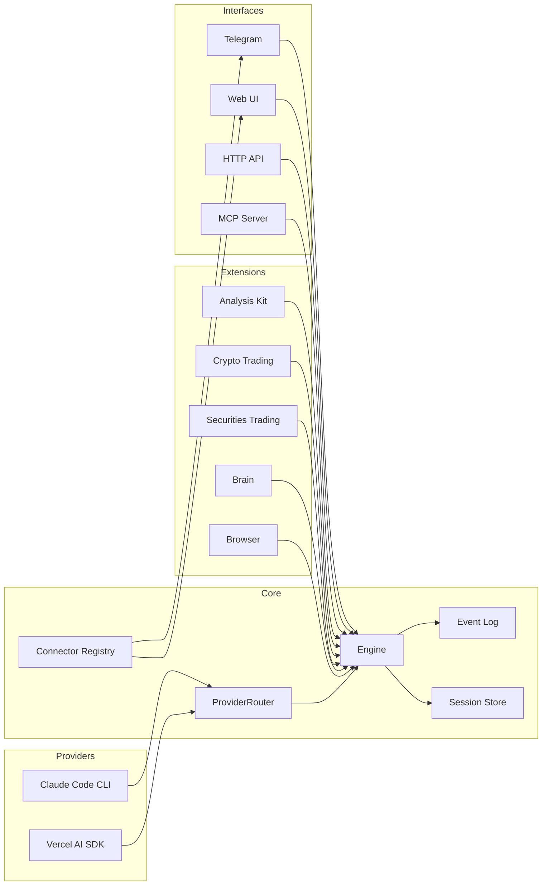

<p align="center">
  
</p>

<p align="center">
  <a href="https://deepwiki.com/TraderAlice/OpenAlice">📖 Documentation</a> · <a href="https://traderalice.com/live">🔴 Live Demo</a> · <a href="https://github.com/TraderAlice/OpenAlice/blob/master/LICENSE">MIT License</a>
</p>

# Open Alice

A personal AI trading agent. She automatically fetches news, computes quantitative factors, logs trade rationale, builds strategies across different timeframes, and monitors and adjusts your portfolio 24/7.

- **File-driven** — Markdown defines persona and tasks, JSON defines config, JSONL stores conversations. Both humans and AI control Alice by reading and modifying files. The same read/write primitives that power vibe coding transfer directly to vibe trading. No database, no containers, just files.
- **Reasoning-driven** — every trading decision is based on continuous reasoning and signal mixing. Visit [traderalice.com/live](https://traderalice.com/live) to see how Alice reasons in real time.
- **OS-native** — Alice can interact with your operating system. Search the web through your browser, send messages via Telegram, and connect to local devices.

## Features

- **Dual AI provider** — switch between Claude Code CLI and Vercel AI SDK at runtime, no restart needed
- **Crypto trading** — CCXT-based execution (Bybit, OKX, Binance, etc.) with a git-like wallet (stage, commit, push)
- **Securities trading** — Alpaca integration for US equities with the same wallet workflow
- **Market analysis** — technical indicators, news search, and price simulation via sandboxed tools
- **Cognitive state** — persistent "brain" with frontal lobe memory, emotion tracking, and commit history
- **Event log** — persistent append-only JSONL event log with real-time subscriptions and crash recovery
- **Web UI** — built-in local chat interface on port 3002, no Telegram account needed

## Architecture



**Providers** — interchangeable AI backends. Claude Code spawns `claude -p` as a subprocess; Vercel AI SDK runs a `ToolLoopAgent` in-process. `ProviderRouter` reads `ai-provider.json` on each call to select the active backend at runtime.

**Core** — `Engine` manages AI conversations with a generation lock and session persistence (JSONL). `EventLog` provides persistent append-only event storage (JSONL) with real-time subscriptions and crash recovery. `ConnectorRegistry` tracks which channel the user last spoke through.

**Extensions** — domain-specific tool sets injected into the engine. Each extension owns its tools, state, and persistence.

**Interfaces** — external surfaces. Web UI for local chat, Telegram bot for mobile, HTTP for webhooks, MCP server for tool exposure.

## Quick Start

### Prerequisites

- Node.js 20+
- pnpm 10+

### Setup

```bash
git clone https://github.com/TraderAlice/OpenAlice.git
cd OpenAlice
pnpm install
cp .env.example .env    # then fill in your keys
```

### AI Provider

OpenAlice ships with two provider modes:

- **Vercel AI SDK** (default) — runs the agent in-process. Supports any provider compatible with the [Vercel AI SDK](https://sdk.vercel.ai/docs) (Anthropic, OpenAI, Google, etc.). Swap the provider implementation in `src/providers/vercel-ai-sdk/` to use your preferred model. Requires an API key for your chosen provider (e.g. `ANTHROPIC_API_KEY` for Anthropic).
- **Claude Code** (file-driven mode) — spawns `claude -p` as a subprocess, giving the agent full Claude Code capabilities. Requires [Claude Code](https://docs.anthropic.com/en/docs/claude-code) installed and authenticated on the host machine. No separate API key needed — uses your Claude Code login. To switch models, see [how to change Claude Code's model](https://docs.anthropic.com/en/docs/claude-code/settings#model-configuration).

### Crypto Trading

Powered by [CCXT](https://docs.ccxt.com/). Defaults to Bybit demo trading. Configure the exchange and API keys in `data/config/crypto.json` and `.env`. Any CCXT-supported exchange can be used by modifying the provider implementation.

### Securities Trading

Powered by [Alpaca](https://alpaca.markets/). Supports paper and live trading — toggle via `data/config/securities.json`. Sign up at Alpaca and add your keys to `.env`. IBKR support is planned.

### Environment Variables

| Variable | Description |
|----------|-------------|
| `ANTHROPIC_API_KEY` | API key for Vercel AI SDK provider (not needed if using Claude Code CLI) |
| `EXCHANGE_API_KEY` | Crypto exchange API key (optional) |
| `EXCHANGE_API_SECRET` | Crypto exchange API secret (optional) |
| `TELEGRAM_BOT_TOKEN` | Telegram bot token (optional) |
| `TELEGRAM_CHAT_ID` | Comma-separated chat IDs to allow (optional) |
| `ALPACA_API_KEY` | Alpaca API key for securities (optional) |
| `ALPACA_SECRET_KEY` | Alpaca secret key for securities (optional) |

### Run

```bash
pnpm dev        # development with watch mode
pnpm build      # production build
pnpm test       # run tests
```

## Configuration

All config lives in `data/config/` as JSON files with Zod validation. Missing files fall back to sensible defaults.

| File | Purpose |
|------|---------|
| `engine.json` | Trading pairs, tick interval, HTTP/MCP ports, timeframe |
| `model.json` | AI model provider and model name |
| `agent.json` | Max agent steps, Claude Code allowed/disallowed tools |
| `crypto.json` | Allowed symbols, exchange provider (CCXT), demo trading flag |
| `securities.json` | Allowed symbols, broker provider (Alpaca), paper trading flag |
| `compaction.json` | Context window limits, auto-compaction thresholds |
| `ai-provider.json` | Active AI provider (`vercel-ai-sdk` or `claude-code`), switchable at runtime |
| `persona.md` | System prompt personality (free-form markdown) |

## Project Structure

```
src/
  main.ts                    # Composition root — wires everything together
  core/
    engine.ts                # Generation lock, delegates to ProviderRouter
    ai-provider.ts           # AIProvider interface + ProviderRouter
    ai-config.ts             # Runtime provider config read/write
    session.ts               # JSONL session store + format converters
    compaction.ts            # Auto-summarize long context windows
    config.ts                # Zod-validated config loader
    event-log.ts             # Persistent append-only event log (JSONL)
    connector-registry.ts    # Last-interacted channel tracker
    media.ts                 # MediaAttachment extraction from tool outputs
    types.ts                 # Plugin, EngineContext interfaces
  providers/
    claude-code/             # Claude Code CLI subprocess wrapper
    vercel-ai-sdk/           # Vercel AI SDK ToolLoopAgent wrapper
  extension/
    analysis-kit/            # Market data, indicators, news, sandbox
    crypto-trading/          # CCXT integration, wallet, tools
    securities-trading/      # Alpaca integration, wallet, tools
    brain/                   # Cognitive state (memory, emotion)
    browser/                 # Browser automation bridge (via OpenClaw)
  connectors/
    web/                     # Web UI chat (Hono, SSE push)
    telegram/                # Telegram bot (grammY, polling, commands)
  plugins/
    http.ts                  # HTTP health/status endpoint
    mcp.ts                   # MCP server for tool exposure
  openclaw/                  # Browser automation subsystem (frozen)
data/
  config/                    # JSON configuration files
  sessions/                  # JSONL conversation histories
  brain/                     # Agent memory and emotion logs
  crypto-trading/            # Crypto wallet commit history
  securities-trading/        # Securities wallet commit history
  event-log/                 # Persistent event log (events.jsonl)
docs/                        # Architecture documentation
```

## Star History

[](https://star-history.com/#TraderAlice/OpenAlice&Date)

## License

[MIT](LICENSE)
