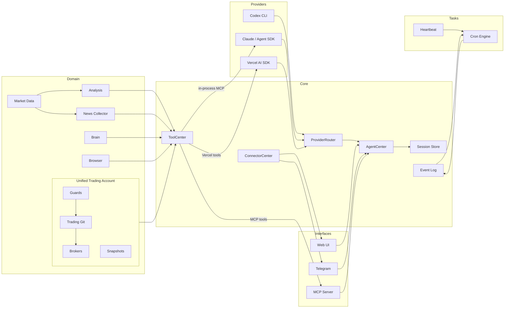

<p align="center">
  
</p>

<p align="center">
  <a href="https://github.com/TraderAlice/OpenAlice/actions/workflows/ci.yml"></a> · <a href="LICENSE"></a> · <a href="https://openalice.ai"></a> · <a href="https://openalice.ai/docs"></a> · <a href="https://deepwiki.com/TraderAlice/OpenAlice"></a>
</p>

# OpenAlice

Your one-person Wall Street. Alice is an AI trading agent that covers equities, crypto, commodities, forex, and macro, from research and analysis through position entry, ongoing management, and exit.

- **Full-spectrum** - analyze and trade across asset classes. Multiple brokers combine into one unified workspace so you're never stuck with "I can see it but can't trade it."
- **Full-lifecycle** - not just entry signals. Research, position sizing, ongoing monitoring, risk management, and exit decisions. Alice covers the entire trading lifecycle, 24/7.
- **Full-control** - every trade goes through version history and safety checks, and requires your explicit approval before execution. You see every step, and you can stop every step.

Alice runs on your own machine, because trading involves private keys and real money. That trust cannot be outsourced.

<p align="center">
  
</p>

> [!CAUTION]
> **OpenAlice is experimental software in active development.** Many features and interfaces are incomplete and subject to breaking changes. Do not use this software for live trading with real funds unless you fully understand and accept the risks involved. The authors provide no guarantees of correctness, reliability, or profitability, and accept no liability for financial losses.

## Features

### Trading

- **Unified Trading Account (UTA)** - multiple brokers (CCXT, Alpaca, Interactive Brokers) combine into unified workspaces. AI interacts with UTAs, never with brokers directly.
- **Trading-as-Git** - stage orders, commit with a message, push to execute. Full history is reviewable with commit hashes.
- **Guard pipeline** - pre-execution safety checks (max position size, cooldown, symbol whitelist) per account.
- **Account snapshots** - periodic and event-driven state capture with equity curve visualization.

### Research and Analysis

- **Market data** - equity, crypto, commodity, currency, and macro data via the TypeScript-native OpenBB engine. Includes unified cross-asset symbol search and a technical indicator calculator.
- **Fundamental research** - company profiles, financial statements, ratios, analyst estimates, earnings calendar, insider trading, and market movers.
- **News** - background RSS collection with archive search.

### Automation

An append-only event log sits at the center of Alice. All system activity, trades, messages, scheduled fires, and heartbeat results, flows through as typed events with real-time subscriptions.

- **Cron scheduling** - cron expressions, intervals, or one-shot timestamps. On fire, Alice routes the event through AI and delivers the reply to your last-used channel.
- **Heartbeat** - a special cron job that periodically reviews market conditions, filters by active hours, and only reaches out when something matters.
- **Webhooks** - inbound event triggers from external systems (planned).

### Interface

- **Web UI** - chat with SSE streaming, sub-channels, portfolio dashboard with equity curve, and full config management.
- **Telegram** - mobile access with a trading panel.
- **MCP server** - tool exposure for external agents.

### And More

- **Multi-provider AI** - Codex CLI, Claude (Agent SDK with OAuth or API key), or Vercel AI SDK (Anthropic, OpenAI, Google), switchable at runtime.
- **Brain** - persistent memory and emotion tracking across conversations.
- **Evolution mode** - permission escalation that gives Alice full project access including Bash, enabling self-modification.

## Architecture

Alice has four layers. Each layer only talks to the one directly above or below it.


```mermaid
graph LR
  subgraph Providers
    CX[Codex CLI]
    AS[Claude / Agent SDK]
    VS[Vercel AI SDK]
  end

  subgraph Core
    PR[ProviderRouter]
    AC[AgentCenter]
    TC[ToolCenter]
    S[Session Store]
    EL[Event Log]
    CCR[ConnectorCenter]
  end

  subgraph Domain
    MD[Market Data]
    AN[Analysis]
    subgraph UTA[Unified Trading Account]
      TR[Trading Git]
      GD[Guards]
      BK[Brokers]
      SN[Snapshots]
    end
    NC[News Collector]
    BR[Brain]
    BW[Browser]
  end

  subgraph Tasks
    CRON[Cron Engine]
    HB[Heartbeat]
  end

  subgraph Interfaces
    WEB[Web UI]
    TG[Telegram]
    MCP[MCP Server]
  end

  CX --> PR
  AS --> PR
  VS --> PR
  PR --> AC
  AC --> S
  TC -->|Vercel tools| VS
  TC -->|in-process MCP| AS
  TC -->|MCP tools| MCP
  MD --> AN
  MD --> NC
  AN --> TC
  GD --> TR
  TR --> BK
  UTA --> TC
  NC --> TC
  BR --> TC
  BW --> TC
  CRON --> EL
  HB --> CRON
  EL --> CRON
  CCR --> WEB
  CCR --> TG
  WEB --> AC
  TG --> AC
  MCP --> AC
```

**Providers** - interchangeable AI backends. Codex uses the local `codex exec` CLI and mounts Alice's MCP server into the Codex run, so the agent is genuinely Codex-driven. Claude uses `@anthropic-ai/claude-agent-sdk` with tools delivered via in-process MCP. Vercel AI SDK runs a `ToolLoopAgent` in-process with direct API calls.

**Core** - AgentCenter routes all AI calls through ProviderRouter. ToolCenter is a shared registry, domain modules register tools there, and it exports them to whichever AI provider is active. EventLog is the central event bus.

**Domain** - business logic. UTA is the trading workspace. Market Data, Analysis, News, and Brain are independent modules, each exposed to AI through tool registrations.

**Automation** - listeners on the EventLog bus. Cron fires scheduled jobs, and Heartbeat is a special cron job for periodic market review.

## Key Concepts

**UTA (Unified Trading Account)** - The core abstraction. Each UTA wraps a broker connection, operation history, guard pipeline, and snapshot scheduler into a single self-contained workspace. AI and the frontend interact with UTAs exclusively, brokers are internal implementation details.

**Trading-as-Git** - The workflow inside each UTA. Stage orders, commit with a message, then push to execute. Push runs guards, dispatches to the broker, snapshots account state, and records a commit with an 8-char hash.

**Guard** - A pre-execution safety check that runs inside a UTA before orders reach the broker. Guards enforce limits such as max position size, cooldown between trades, and symbol whitelists.

**Heartbeat** - A periodic check-in where Alice reviews market conditions and decides whether to send you a message.

**Connector** - An external interface through which users interact with Alice. Built-in connectors include Web UI, Telegram, and MCP Ask. Delivery always goes to the channel you last spoke through.

**AI Provider** - The AI backend that powers Alice. The default is Codex CLI (`codex exec`) with Alice's MCP tools mounted into the local Codex session. Claude and Vercel AI SDK are also available, and providers can be switched at runtime with no restart needed.

## Quick Start

Prerequisites: Node.js 22+, pnpm 10+, and [Codex CLI](https://developers.openai.com/codex/cli) installed and authenticated.

```bash
git clone https://github.com/TraderAlice/OpenAlice.git
cd OpenAlice
codex login
corepack pnpm install && corepack pnpm build
corepack pnpm dev
```

Open [localhost:3002](http://localhost:3002) and start chatting. No API keys or extra provider setup are needed. The default profile uses your local Codex CLI session.

```bash
corepack pnpm dev        # start backend (port 3002) with watch mode
corepack pnpm dev:ui     # start frontend dev server (port 5173) with hot reload
corepack pnpm build      # production build (backend + UI)
corepack pnpm test       # run tests
```

> **Note:** Port 3002 serves the UI only after `pnpm build`. For frontend development, use `pnpm dev:ui` (port 5173), which proxies to the backend and provides hot reload.

## Daily Workflow

For normal daily use, the shortest path is:

```bash
cd OpenAlice
codex login   # only when needed
corepack pnpm dev
```

Then open [localhost:3002](http://localhost:3002) and chat with the default profile. That profile routes every turn through local Codex CLI, and Codex reaches Alice's trading, research, browser, and session tools through the built-in MCP server on port `3001`.

If you want a different backend later, open the AI Provider page in the Web UI and switch profiles there. No restart is required.

On Windows, you can use the bundled launcher instead:

```powershell
powershell -ExecutionPolicy Bypass -File .\scripts\start-openalice.ps1
```

Or:

```bat
.\scripts\start-openalice.cmd
```

Or, if you prefer npm scripts:

```bash
corepack pnpm dev:codex
```

## Configuration

All config lives in `data/config/` as JSON files with Zod validation. Missing files fall back to sensible defaults. You can edit these files directly or use the Web UI.

**AI Provider** - The default provider is Codex CLI, which uses your local `codex login` session and runs Alice through `codex exec` with Alice's MCP tools attached automatically. To use Claude Agent SDK or the [Vercel AI SDK](https://sdk.vercel.ai/docs) instead, switch `ai-provider-manager.json` or use the Web UI. Providers can be switched at runtime with no restart.

**Trading** - Unified Trading Account (UTA) architecture. Each account in `accounts.json` becomes a UTA with its own broker connection, git history, and guard config.

| File | Purpose |
|------|---------|
| `engine.json` | Trading pairs, tick interval, timeframe |
| `agent.json` | Max agent steps, evolution mode toggle, Claude Code tool permissions |
| `ai-provider-manager.json` | Active AI provider profile (`codex`, `agent-sdk`, or `vercel-ai-sdk`), login method, switchable at runtime |
| `accounts.json` | Trading accounts with `type`, `enabled`, `guards`, and `brokerConfig` |
| `connectors.json` | Web/MCP server ports, MCP Ask enable |
| `telegram.json` | Telegram bot credentials and enable flag |
| `web-subchannels.json` | Web UI sub-channel definitions with per-channel AI provider overrides |
| `tools.json` | Tool enable/disable configuration |
| `market-data.json` | Data backend configuration and provider API keys |
| `news.json` | RSS feeds, fetch interval, retention period |
| `snapshot.json` | Account snapshot interval and retention |
| `compaction.json` | Context window limits and auto-compaction thresholds |
| `heartbeat.json` | Heartbeat enable/disable, interval, and active hours |

Persona and heartbeat prompts use a default plus user override pattern:

| Default (git-tracked) | User override (gitignored) |
|------------------------|---------------------------|
| `default/persona.default.md` | `data/brain/persona.md` |
| `default/heartbeat.default.md` | `data/brain/heartbeat.md` |

On first run, defaults are auto-copied to the user override path. Edit the user files to customize without touching version control.

## Project Structure

OpenAlice is a pnpm monorepo with Turborepo build orchestration. See [docs/project-structure.md](docs/project-structure.md) for the full file tree.

## Roadmap to v1

OpenAlice is in pre-release. All planned v1 milestones are now complete. Remaining work is testing and stabilization.

- [x] **Tool confirmation** - achieved through Trading-as-Git's push approval mechanism.
- [x] **Trading-as-Git stable interface** - the core workflow is stable and running in production.
- [x] **IBKR broker** - Interactive Brokers integration via TWS/Gateway.
- [x] **Account snapshot and analytics** - periodic and event-driven snapshots with equity curve visualization.

## Star History

[](https://star-history.com/#TraderAlice/OpenAlice&Date)
