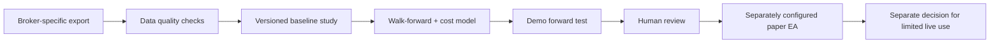

# JMB Goldmine Product Requirements Document

**Product:** JMB Goldmine  
**Version:** 1.0  
**Status:** Working baseline - pending explicit approval of promotion thresholds and MT5 EA design  
**Last updated:** 2026-06-26  
**Product strategy:** Research-first, paper-readiness before automated execution

## 1. Purpose

JMB Goldmine is a local-first AI trading research and decision-support workspace. It brings a user's broker-connected market context, research, evidence, and proposed trade actions into one private application while keeping the user in control of any execution.

**Branding note:** JMB Goldmine is the product name. Legacy technical identifiers such as `OPENALICE_*`, `.openalice`, workspace CLI names, and MT5 Common Files folders remain unchanged for compatibility with existing data, workspace configuration, and read-only MT5 bridge installations.

This PRD is the planning boundary for the JMB Goldmine research milestone, not a rewrite of every OpenAlice platform capability. The README may still describe OpenAlice as a broad end-to-end trading platform; this milestone is narrower and safety-first. A request that does not map to a goal, workflow, requirement, or explicitly approved change in this document should be clarified before implementation. The goal is not to suppress useful ideas; it is to stop the product becoming an expensive grab-bag of half-finished features.

## 2. Product decision and scope boundary

The repository contains two different maturity levels:

- The existing JMB Goldmine platform supports multi-broker Unified Trading Accounts (UTAs), staged Trading-as-Git orders, guarded execution, agent workspaces, and automation.
- The MT5 Research Desk and bridge remain **research-only** evidence surfaces for HFM and IC Markets instruments. They cannot receive broker credentials, expose an execution endpoint, or submit orders.
- The current app implementation includes a local `/research` dashboard, artifact-backed baseline and walk-forward summaries, a fixed-matrix experiment ledger, and a read-only MT5 demo bridge heartbeat. Separately, the locally installed and independently approved Plan 3 EA may execute Gold only on the exact allowlisted HFM and IC Markets demo accounts after local operator enablement; it exposes no remote order command.

To resolve that conflict, this PRD defines the next product milestone as **Research-First / Paper-Readiness**. Existing UTA and workspace functionality remains supported platform capability, but no new live-trading or autonomous-execution promise is implied by this milestone.

The broader platform remains experimental and its cross-broker execution/automation paths should be treated as beta capabilities until they have their own release criteria. This PRD does not require completing, marketing, or expanding those paths as a prerequisite for the research milestone.

### Current architecture constraints

- Alice and UTA are split into separate processes. Alice owns workspaces, research, market/news/analysis surfaces, and the user-facing web app; UTA owns broker credentials, broker adapters, order state, guard checks, FX, and snapshots.
- Alice reaches UTA through a loopback HTTP SDK. The current v1 safety boundary relies on local binding and same-host trust; a public or remote UTA carrier needs its own auth and deployment acceptance criteria before it is in scope.
- The in-process model loop is gone. AI work runs inside native workspace CLIs and scheduled jobs spawn headless Workspaces that report through the Inbox.
- Research Desk evidence must stay outside execution authority even though the wider platform still supports staged UTA orders with explicit user approval.

### In scope for this milestone

1. A local Research Desk that truthfully shows broker-specific data availability, data quality, backtest evidence, validation status, latest completed-bar observations, and relevant news.
2. A repeatable, auditable research workflow for the initial instruments:
   - Gold / USD: HFM research/live `XAUUSDb` (current demo `XAUUSD`), IC Markets `XAUUSD`
   - Euro / USD: HFM `EURUSDb`, IC Markets `EURUSD`
3. Controlled promotion from raw data to a paper-trading candidate, with explicit gates and durable evidence.
4. Clear separation between research, paper trading, and live trading.
5. Preservation of the existing UTA safety model for any supported broker execution: staging, guard checks, explicit approval, audit history, and account isolation.

### Explicitly out of scope for this milestone

- A profitable strategy claim, signal-selling service, or investment advice.
- Autonomous MT5 live trading, self-modifying live strategies, or an AI agent in the tick-by-tick execution path.
- Enabling an Expert Advisor (EA) to trade solely because one backtest was positive.
- Adding new brokers, asset classes, social/community features, mobile apps, or a multi-tenant cloud service.
- Replacing broker-native risk controls with an LLM.
- Using data from one broker to represent fills, costs, or performance at another broker without conspicuous labelling.

## 3. Users and jobs to be done

### Primary user: single, technically capable retail trader/researcher

The user runs JMB Goldmine on their own machine, controls their broker accounts and AI-provider access, and wants a disciplined way to investigate a strategy without trusting a black-box bot.

| Job | Desired outcome |
| --- | --- |
| Gather broker data | Know exactly which data was exported, from which broker and symbol, and whether it is usable. |
| Evaluate an idea | Run reproducible research with train/validation/holdout separation and realistic costs. |
| Understand current evidence | See what passed, failed, is incomplete, and the next required step without interpreting raw files. |
| Use AI for research | Ask an agent to analyse information while keeping research distinct from authority to trade. |
| Trade only with control | If using existing UTA capability, review a staged order, see guard results, and explicitly approve execution. |
| Recover or audit | Reconstruct why a decision or order occurred from persistent artifacts and history. |

### Secondary user: developer/operator

The operator needs stable local installation, diagnosable failures, isolated credentials, and enough written constraints to extend the application without accidentally broadening trading authority.

## 4. User experience and core workflows

### A. Evidence-led research workflow (MVP)

1. The user connects or exports history from an MT5 terminal using the exact configured broker symbol.
2. OpenAlice stores/reads the local export and records source, coverage, contract metadata, gaps, and validation outcome.
3. The user runs a versioned baseline study. The study records data range, strategy version, parameters, cost assumptions, training selection, validation, untouched holdout, and decision.
4. The Research Desk displays only facts supported by those artifacts: availability, data quality, baseline and walk-forward results, evidence grade, latest **completed** bar observation, read-only bridge state where available, experiment ledger entries, and outstanding gates.
5. A failed holdout is shown as rejected; it may not be silently promoted or presented as a signal.
6. An evidence candidate can advance only after its required validation gates are complete. It remains research-only until a separately configured demo/paper execution integration exists.

### B. Existing UTA trade-control workflow (platform capability)

1. The user configures an isolated UTA for one broker/account.
2. An agent or user researches and constructs a proposed order.
3. The order is staged, committed with a human-readable reason, and evaluated by account guards.
4. The user explicitly approves the push to the broker.
5. OpenAlice records broker response, order lifecycle, account snapshots, and execution history.
6. The user can inspect, cancel, amend, or reject work where broker capabilities allow.

**Rule:** Research Desk evidence must never directly create, stage, approve, or push a broker order.

For an existing manual order form that combines stage, commit, and push, the final clearly labelled confirmation is the user's explicit approval. The UI must make that consequence unambiguous before submission; it must never be mistaken for a draft or research action.

### C. Promotion workflow

Every arrow requires a saved artifact and an explicit recorded decision. A failure returns the candidate to research or rejects it; it never skips forward.

## 5. Functional requirements

### R1. Local-first and single-user operation

- The application must run locally by default and bind sensitive services to localhost by default.
- Broker credentials must remain outside the agent runtime wherever the architecture permits; the UTA/carrier owns broker connectivity.
- The app is single-user. Multi-user sharing, role management, and tenancy are not implied.

### R2. Research artifact integrity

- Research artifacts must be stored outside deployable application files, in a persistent local data directory.
- Each artifact must identify broker, exact broker symbol, canonical instrument, time range, creation time, and schema/version.
- A study must include strategy/version identifier, parameters, cost assumptions, data source, training/validation/holdout windows, performance measures, and a human-readable conclusion.
- Missing, unreadable, stale, or malformed artifacts must produce a visible unavailable/failed state, never fabricated data.

### R3. Data quality and provenance

- MT5 export validation must detect and report coverage, duplicates, timestamp ordering, malformed rows, and material gaps.
- Contract metadata must include at least digits, point, contract size, minimum/maximum/step volume, stop distance, and trading mode when supplied by the terminal.
- The actual broker symbol must travel with all exports, reports, displayed results, and later orders.
- Data with incorrect resolution or known fallback history must be excluded from calculations and labelled as excluded.

### R4. Research Desk

- Provide a read-only `/research` view that clearly says research-only and trading off.
- Per configured instrument, show export availability, date/file coverage, artifact availability, baseline/holdout results, walk-forward status, evidence grade, latest completed-bar observation, read-only bridge state when available, and the next validation requirement.
- Display recent news only as contextual research material, not as a trade command or profitability forecast.
- State that evidence grades reflect completed validation, not probability of profit.
- Refreshing must not mutate data, broker state, or trading state.

### R5. Strategy evaluation discipline

- Time-series research must preserve chronology; no random shuffling of future observations into training.
- Parameter selection must be isolated from the final untouched holdout period.
- Walk-forward evaluation and broker-specific cost modelling are required before promotion to a demo candidate.
- The system must record a rejection when acceptance criteria are not met. A rejected candidate cannot appear as approved or recommended.
- Current observed research status is broker-specific and must be displayed as evidence, not endorsement:

| Broker / symbol | Current status |
| --- | --- |
| HFM `EURUSDb` | Rejected by historical holdout / walk-forward evidence. |
| HFM `XAUUSDb` | Early historical research candidate only; broker-specific cost model, review, and demo forward test remain required. |
| IC Markets `EURUSD` | Rejected when its own artifacts are present; otherwise waiting for export/artifact evidence. |
| IC Markets `XAUUSD` | Early historical research candidate when its own artifacts are present; otherwise waiting for export/artifact evidence. Broker-specific cost model, review, and demo forward test remain required. |

These are records of evidence, not product endorsements.

### R6. Safety boundary for the approved broker-local MT5 demo EA

- The [approved Plan 3 design](superpowers/specs/2026-07-13-jmb-goldmine-demo-canary-execution-design.md) governs the separately installed broker-local EA. The EA owns tick processing, position sizing, and order submission locally; OpenAlice/AI cannot be on the tick-time execution path and exposes no remote order command.
- Plan 3 is HFM-first. IC Markets may be enabled only after reviewed HFM request, broker-result, stop-protection, durable-log, and restart-reconciliation evidence.
- `XAUUSD` is the only execution-eligible instrument. EURUSD remains shadow-only, all non-demo accounts are blocked, and Plan 3 has no live-mode input or live-account eligibility.
- Status-only mode, execution disabled, and the persistent kill switch are the defaults. Demo execution requires deliberate local operator policy and EA-input changes on the exact account binding.
- The EA must enforce an instrument allowlist, risk-per-trade, total open risk, daily-loss, consecutive-loss, spread, slippage, session/news, and one-position-per-symbol limits.
- A persistent kill switch must block new entries; closing positions requires separately explicit configuration.
- Broker/account-specific magic numbers and logs are required for auditability.
- These requirements require automated tests plus an operator-only MetaEditor compile, harness, status-only observation, and broker-evidence ceremony; automation cannot mark those human gates complete.

### R7. Existing UTA execution protections

- App-, API-, UI-, workspace-, and AI-managed broker orders must go through a UTA, not directly from AI tools or the UI.
- The independently approved broker-local MT5 Gold demo EA is governed by R6 rather than the app-managed UTA order flow. It reads local artifacts, binds exact demo accounts inside MT5, and exposes no remote order command to the app, API, Research Desk, scheduler, Codex, or AI.
- Orders must pass configured guards before broker submission.
- User approval is required before execution. Agent text, schedules, research results, or news alone cannot constitute approval.
- A manual one-step order form may use its final confirmation as approval only when it explicitly names the affected account, instrument, order details, estimated exposure, and that submission will send the order to the broker.
- The system must persist staged work, commits/rejections, guard outcomes, broker results, and snapshots.
- Guard or broker failures must be actionable and must not leave the UI reporting a successful order unless the broker state supports it.

### R8. AI workspace and automation boundaries

- AI workspaces may research, create reports, and surface results through the Inbox.
- Scheduled headless workspaces may report findings but may not bypass the execution approval boundary.
- Prompt/tool context should be scoped to the task; persistent research summaries and artifacts should be referenced instead of repeatedly rediscovering the same context.
- Credentials and capability exposure must be explicit; a workspace receives only what it needs.

### R9. Observability and recovery

- Important operations must produce a durable, inspectable record with timestamps and account/instrument attribution.
- The user must be able to distinguish local cached data, broker data, hosted Hub data, and data with unknown or stale provenance.
- Errors must explain the action, cause when known, safe next step, and whether broker state may need external verification.
- Any data or execution path that cannot be verified must fail visibly rather than infer success.

## 6. Non-functional requirements

| Area | Requirement |
| --- | --- |
| Safety | Favor refusal and explicit user action over silent fallback in any trading-related path. |
| Privacy | Treat broker keys, positions, trade history, and AI credentials as private local data. |
| Reliability | Preserve research and trade evidence across app upgrades and restarts. |
| Maintainability | Keep domain logic outside UI components; use typed schemas at boundaries; avoid duplicated broker logic. |
| Explainability | Results, guard blocks, data quality states, and promotion decisions must be understandable without reading source code. |
| Testability | Risk gates, promotion rules, data validators, and broker adapters need automated tests plus broker/paper acceptance scenarios where relevant. |
| Performance | Research view should remain responsive with local artifact summaries; large raw data must be processed in bounded/streamed jobs, not loaded wholesale into the UI. |
| Accessibility | State is conveyed with text as well as color; empty, error, and loading states are clear. |

## 7. Acceptance criteria for the milestone

The milestone is complete only when all of the following are true:

- [ ] The Research Desk has a clear research-only, no-trading boundary and no route/tool that can submit an order from that view.
- [ ] HFM `XAUUSDb` and `EURUSDb` exports show broker-specific availability and quality status; excluded fallback data is not treated as eligible M1 data.
- [ ] IC Markets instruments remain visibly waiting until their own exports and reports exist; when their own artifacts are present, the Research Desk displays their broker-specific rejected/candidate status without borrowing HFM evidence.
- [ ] Each displayed baseline result has a persisted artifact with provenance and a separate training/holdout record.
- [ ] Failed holdouts are visibly rejected; positive early evidence is described as a candidate, not a recommendation.
- [ ] The documented promotion gates are displayed and cannot be represented as complete without their evidence.
- [ ] Regression tests cover artifact parsing/error states, evidence grading, no-order research route behavior, and the existing UTA approval/guard boundary.
- [ ] Any manual one-step order form has an explicit, test-covered final execution confirmation; a staged order is not displayed as filled until broker reconciliation/sync supports that state.
- [ ] There are zero Research Desk, scheduler, workspace, Codex, or AI execution endpoints for the Plan 3 EA; app/API/AI-managed orders continue to require UTA approval and guards.
- [ ] Stage 0 records both exact demo-account bindings locally, with execution disabled and kill switches on, without exposing either account login in repository or Research API artifacts.
- [ ] Each canary broker submission has a durable pre-request event and broker-confirmed stop protection; unknown results fail closed into reconciliation rather than resend.
- [ ] Reviewed HFM canary evidence exists before any IC Markets execution enablement or `ic_canary` promotion.
- [ ] The current MT5 data and training protocol remains accurate and links to this PRD.

## 8. Success measures

These measures describe confidence and product discipline, not investment return.

| Measure | Target for this milestone |
| --- | --- |
| Provenance | 100% of displayed studies identify broker, exact symbol, source range, and artifact version. |
| Truthfulness | 0 cases where missing/unverified evidence is displayed as a completed result or live signal. |
| Research reproducibility | A developer can recreate a displayed result from its documented artifact inputs and study version. |
| Safety | 0 paths from Research Desk or scheduled research output to unapproved order execution. |
| Data quality | 100% of included data is marked eligible by the validator; exclusions are retained and explained. |
| Operator clarity | A user can identify the current stage and next blocking gate for every configured instrument from one page. |

## 9. Prioritized roadmap

### Now — baseline and research truthfulness

1. Finalize the PRD and make it the planning entry point.
2. Harden research artifact schemas, validation, storage, and test coverage.
3. Complete the read-only Research Desk and document its data contracts.
4. Keep IC Markets evidence broker-specific: display observed artifacts when present, and do not infer equivalence from HFM data.

### Next — paper-readiness evidence

1. Add walk-forward reports and broker-specific spread, commission, financing, and slippage models.
2. Add a decision log for candidate/rejected/paused studies.
3. Define and test a paper-only MT5 EA interface with the risk gates in R6.
4. Run meaningful demo forward tests and review exceptions before any promotion discussion.

### Later — only after an explicit PRD revision

1. Limited live MT5 deployment with a separately approved risk policy and operator ceremony.
2. Additional broker/instrument support.
3. Remote/separated UTA carrier deployment, public mode, or richer automation capabilities.

## 10. Decisions that require explicit approval before implementation

The following are deliberately undecided. Do not silently choose one during feature work:

| Decision | Why it matters |
| --- | --- |
| Exact promotion thresholds | A return or Sharpe threshold alone is insufficient; acceptable drawdown, sample size, robustness, and operational risk need a written policy. |
| Paper-test duration and sample size | This controls when a candidate may progress and cannot be guessed from a backtest. |
| MT5 EA technology/design | It affects deployment, logging, risk enforcement, and how the app communicates with MT5. |
| Live-trading eligibility | Requires separate risk, legal, operational, and user-confirmation requirements. |
| Any broker credentials available to AI | Changes the threat model and should be a conscious, minimized exception. |
| Product positioning | Decide whether OpenAlice is primarily a general trading platform, a research workstation, or both with separately versioned milestones. |

## 11. Documentation contract

- `README.md` remains the platform overview and must not present research candidates as trade recommendations.
- `docs/mt5-data-and-training-protocol.md` is the operational evidence and EA-risk protocol for this milestone.
- `docs/project-structure.md` must be refreshed before or alongside architecture work that changes the Alice/UTA split, workspace execution model, routes, connectors, or package layout.
- This PRD is the source of truth for product scope, priorities, acceptance criteria, and out-of-scope boundaries.
- If implementation changes any requirement, safety boundary, workflow, or promotion gate, update this PRD and the relevant operational document in the same change.

## 12. Assumptions and open risks

- The intended operator is a single, technically capable user running software locally; this is not a regulated advisory or managed-trading product.
- Broker APIs and MT5 history can be incomplete, delayed, or venue-specific; external/broker-side verification remains necessary.
- AI can assist with analysis and documentation but is not a source of market truth or authority to trade.
- Financial, operational, and security risks remain material even with all guards present. The product must communicate this plainly.

## 13. Change-intake rule

Before implementation, each feature request or bug fix should state:

1. The PRD section/requirement it serves (or an explicit proposal to change this PRD).
2. The user problem and smallest acceptable outcome.
3. Any safety, data-provenance, migration, or documentation impact.
4. Testable acceptance criteria and what is intentionally not being changed.

If a request spans both the Research Desk and execution, split it into separate changes. Research work must retain its read-only boundary; execution work needs an independently approved scope and safety review.
