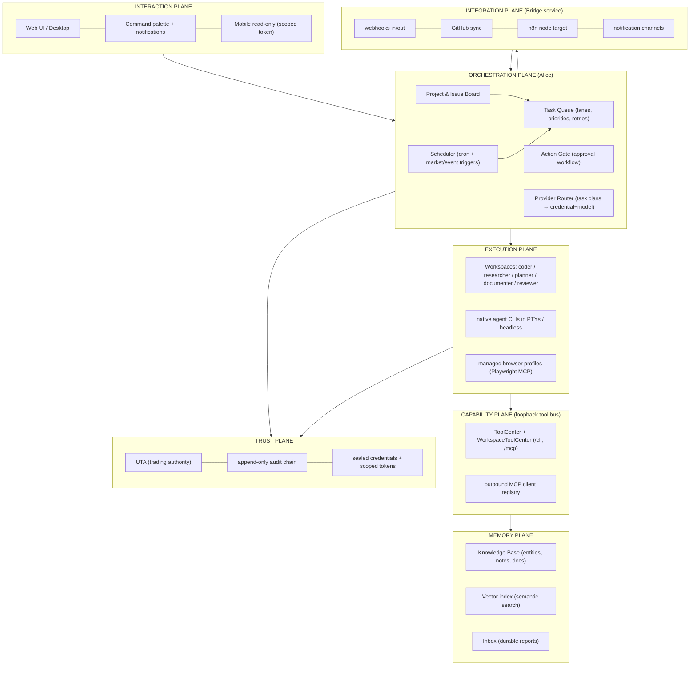
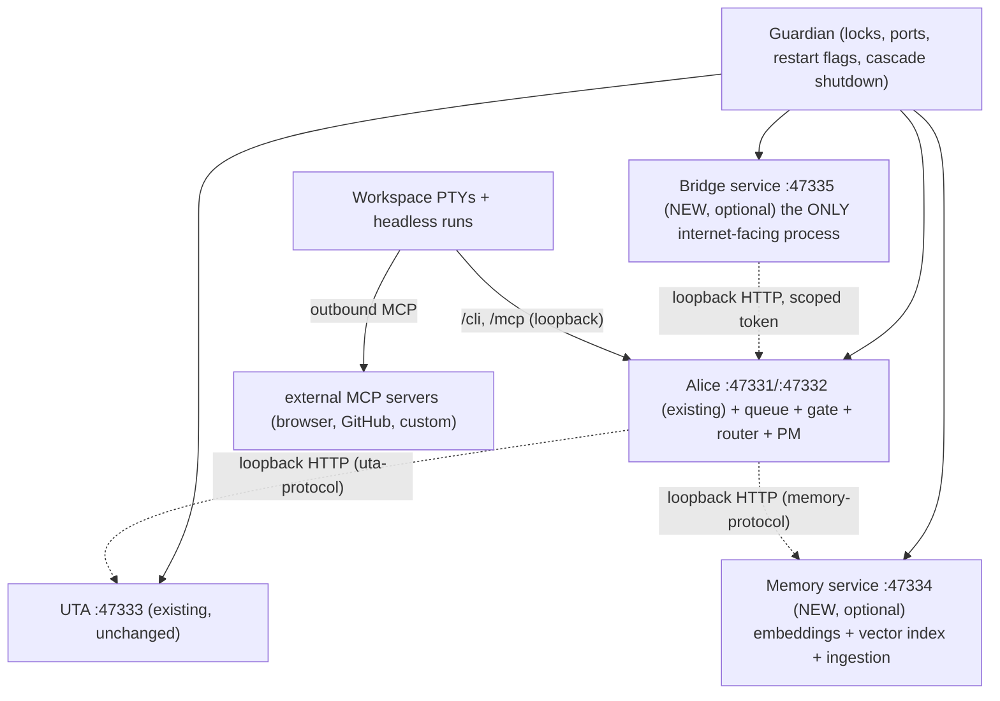
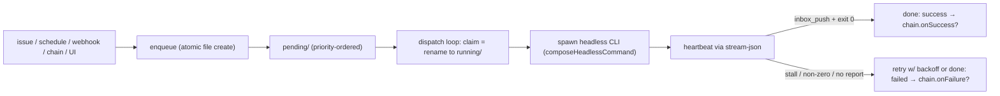
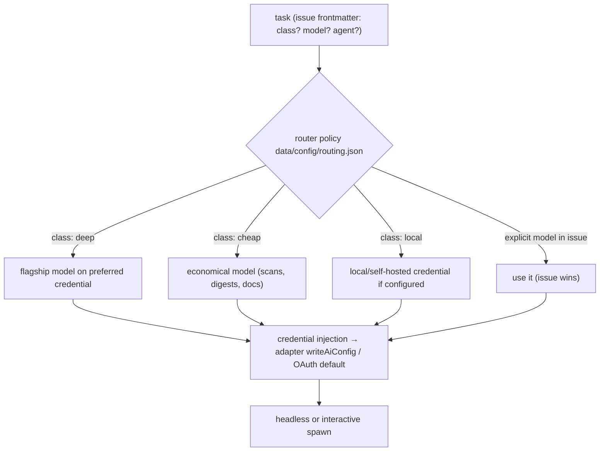
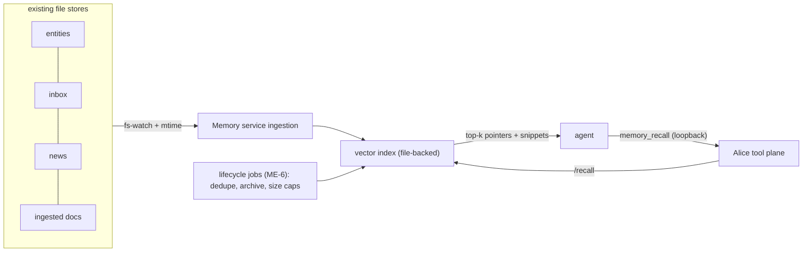
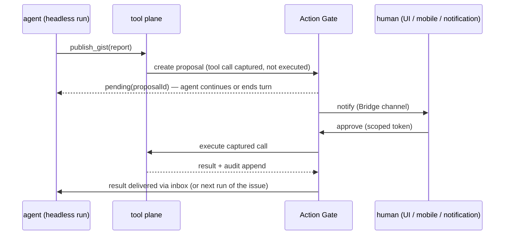
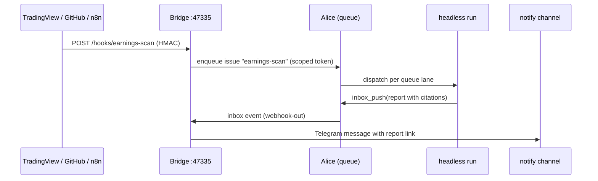

# AI-OS Design: OpenAlice as a Personal AI Operating System

**Status: design document — nothing here is implemented or committed work.**
This is a planning surface like [[docs/roadmap.md]]: current code overrides
this prose. It builds on the audit in [[docs/architecture.md]] and reuses
roadmap IDs (`ME-1`, `AU-1`, …) where a design element already has a costed
entry.

---

## 1. Design Goals and Principles

**Goal.** One person operates a fleet of AI agents that code, research, plan,
and document autonomously — with durable memory, external integrations, and a
human approval gate in front of anything irreversible.

**Principle 0 — extend, don't replace.** OpenAlice already implements the hard
core of an AI OS: per-task workspaces with native agent CLIs, a schedule
scanner, a headless task registry, an approval-gated execution path, a
credential vault with provider wire-capabilities, and a two-plane tool system.
The design below adds the *missing organs*, not a new skeleton.

The three architectural invariants remain law:

1. **No in-process model loop.** Autonomy is headless Workspace dispatch into
   native CLIs (`claude`, `codex`, `opencode`, `pi`).
2. **Money-capable writes live in UTA only.** The generalized approval gate
   (§ 9) governs *non-trading* risky actions; trading keeps its existing path.
3. **Capabilities ship as templates, skills, or satellites** — engine changes
   are reserved for genuine substrate (queue, memory, gate, bridge).

Two additions to the constitution for AI-OS scope:

4. **Files are the bus.** State, queues, and events are inspectable files under
   `OPENALICE_HOME`, governed by the migration framework. No Redis/Postgres.
5. **The internet-facing surface is one process.** Everything new that must
   accept inbound traffic lives in a dedicated Bridge service; Alice and UTA
   stay loopback + token.

---

## 2. Target Architecture

### 2.1 Planes



### 2.2 Process topology (what actually runs)

Guardian's supervision model extends from 2 children to 4 (+ managed browser
processes owned per-workspace). Everything except Bridge binds loopback.



**Why exactly two new services (and not more):**

- **Memory service** is separate because embedding models are heavy native
  deps (ONNX runtime) that lite installs must be able to skip, and index
  corruption must never take Alice down. Same pattern as UTA: optional
  carrier, Alice degrades gracefully (falls back to substring search).
- **Bridge service** is separate because it is the only component that may be
  exposed beyond localhost. Compromise of Bridge must yield only a scoped
  token to Alice, never broker credentials or the tool plane.
- Everything else (queue, router, gate, PM) is **in Alice** — they are
  coordination logic over files, not resource-heavy or trust-boundary
  concerns. New processes are a cost, not a virtue.

---

## 3. Capability Map

Every capability from the objective, mapped to build-on vs. new:

| # | Capability | Foundation that exists today | What's new (design section / roadmap ID) |
|---|---|---|---|
| 1 | Autonomous coding | Workspaces + native CLIs + git | Coder role template + GitHub sync (§ 6, GH-1) |
| 2 | Autonomous research | Chat template + market/news tools | Researcher role + citation contract (§ 6, KB-5) |
| 3 | Autonomous planning | Issue board + schedules | Planner role that *writes* issues/projects (§ 6, § 11) |
| 4 | Autonomous documentation | Docs culture, templates | Documenter role + doc-sync tasks (§ 6) |
| 5 | GitHub integration | dugite in-tree, git everywhere | Bridge GitHub module (§ 10, GH-1/GH-2/GH-4) |
| 6 | n8n integration | — | Bridge webhooks + n8n community node (§ 10, N8-1/N8-2) |
| 7 | Browser automation | Agent CLIs speak MCP | Managed Playwright MCP + profile store (§ 8) |
| 8 | MCP servers | Inbound `/mcp`, `/mcp/:wsId` | Outbound MCP client registry (§ 8, MC-1) |
| 9 | Scheduling | ScheduleScanner (60s tick) | Event triggers + calendars (AU-2/AU-4) |
| 10 | Task queues | HeadlessTaskRegistry (cap 8) | Durable queue: lanes/priority/retry (§ 5) |
| 11 | Long-term memory | Entity store + Inbox + persona | Memory service + lifecycle jobs (§ 7, ME-1/ME-6) |
| 12 | Vector search | — | File-backed vector index in Memory service (§ 7) |
| 13 | Semantic search | substring `search()` only | `memory_recall` tool + hybrid ranking (§ 7, ME-2) |
| 14 | Local knowledge base | Obsidian-like entities + wikilinks | Ingestion pipeline + typed relations (§ 7, KB-1/ME-3) |
| 15 | Multiple AI providers | Credential vault + wire shapes + presets | (exists — extend catalog only) |
| 16 | Provider routing | `lastModel`, per-workspace override | Router policy: task class → cred+model (§ 6.2, AI-1) |
| 17 | Specialized agents | Templates + skills + adapters | Role metadata + permission profiles (§ 6, AG-1/AG-5) |
| 18 | Background workers | Headless dispatch | Queue workers = dispatch loop consumers (§ 5) |
| 19 | Notification system | Inbox (pull only) | Bridge notify channels + UI center (§ 10, AU-6/UI-5) |
| 20 | Approval workflow | Trading-as-Git (UTA-only) | Generalized Action Gate for non-trading (§ 9) |
| 21 | Project management | Issue board + markdown issues | Projects, milestones, dependencies (§ 11) |

---

## 4. Communication Model

One rule per link type, no exceptions:

| Link | Transport | Auth | Notes |
|---|---|---|---|
| UI ↔ Alice | HTTP + WS/SSE (`/api/*`) | admin/scoped token | existing |
| Agent ↔ tools | loopback HTTP (`/cli/:wsId`, `/mcp/:wsId`) | identity-by-URL, loopback-only | existing; never internet-exposed |
| Alice ↔ UTA | loopback HTTP (`uta-protocol`) | loopback | existing |
| Alice ↔ Memory | loopback HTTP (`memory-protocol`, new package mirroring `uta-protocol`) | loopback | degrade to substring search when absent |
| Bridge → Alice | loopback HTTP | **scoped token** (SE-2), never admin | Bridge is untrusted-by-design |
| World → Bridge | HTTPS webhooks | HMAC-signed per-endpoint secrets | the only inbound door |
| Alice → world | Bridge outbound (notify, GitHub, webhooks-out) | per-channel creds sealed at rest | Alice never dials the internet directly for integrations |
| Agent → world | outbound MCP + browser | per-workspace declaration, permission-gated | § 8 |
| Process control | files (`data/control/*.flag`), Guardian-watched | filesystem | existing pattern, extended to new services |

**Event flow stays file-first.** There is deliberately no message broker: the
queue, gate proposals, and run records are journaled JSON/markdown under
`OPENALICE_HOME`, which keeps the whole OS greppable, backupable, and
migration-governed (invariant 4). Cross-process "events" are HTTP polls +
file watches, exactly like today's `restart-uta.flag`.

---

## 5. Task Queue and Background Workers

Evolves `HeadlessTaskRegistry` (currently: flat cap of 8) into a durable
queue. **Workers are not new processes** — the "worker pool" is Alice's
dispatch loop consuming the queue and spawning headless CLI runs, which are
the actual workers (invariant 1).

```text
<OPENALICE_HOME>/data/queue/
├── pending/<priority>-<ts>-<id>.json     one file per task (atomic rename to claim)
├── running/<id>.json                     claimed tasks + heartbeat mtime
├── done/<yyyy-mm>/<id>.json              journal (retention-pruned)
└── lanes.json                            lane definitions + concurrency
```

Task record: `{ id, source (issue|schedule|webhook|chain|manual), wsId, agent,
prompt|issueRef, lane, priority, attempt, maxAttempts, timeoutMs, notBefore,
chain: { onSuccess?: issueRef, onFailure?: issueRef } }`.

Semantics:

- **Lanes** (AU-5): per-workspace serial lane by default (no self-competing
  runs), named parallel lanes for fan-out (MA-4). Global cap stays.
- **Priorities**: interactive-initiated > event-triggered > cron.
- **Retry** (AG-3): exponential backoff via `notBefore`, `maxAttempts` from
  issue frontmatter; failures classified by AG-6 outcome detection.
- **Timeout + heartbeat** (AG-2): dispatch loop kills runs whose heartbeat
  (stream-json activity) stalls; the record moves to `done/` as `timeout`.
- **Crash safety**: on boot, `running/` entries with a dead pid re-queue with
  `attempt+1` (idempotent because issues are self-describing).



---

## 6. Specialized Agents and Provider Routing

### 6.1 Roles are templates + skills + permissions — not code

A **role** = template (`instruction.md`, bundled skills) + a tool permission
profile (AG-5) + a default provider-routing class. Five shipped roles:

| Role | Template focus | Tool profile | Typical routing class |
|---|---|---|---|
| **Coder** | repo conventions, test-first, PR etiquette | git, issue, inbox — no trading | `deep` (flagship) |
| **Researcher** | citation contract (KB-5), entity upsert discipline | market, news, entities, browser | `deep` |
| **Planner** | decompose goals into issues/projects with schedules & dependencies | issue/project write, inbox | `deep` |
| **Documenter** | owner-guide rules, doc drift detection | fs read, issue, inbox | `cheap` |
| **Reviewer** (MA-1) | adversarial rubric, verdict schema (AI-2) | read-only + inbox | `deep` |

Roles compose: a project (§ 11) declares which role handles which issue type.
Users and the community add roles as extensions (PL-1) — zero engine change.

### 6.2 Provider Router

A small policy layer resolved at **injection time** (where credentials already
flow), never at runtime inside a loop:



Policy shape: `{ classes: { deep: {credentialSlug, model}, cheap: {...},
local: {...} }, roleDefaults: { researcher: "deep", documenter: "cheap" },
budget?: { dailyTokens?, monthlyUSD? } }` — enforced with AI-3 cost
accounting; when a budget trips, the router degrades `deep → cheap` and
notifies rather than silently stopping.

---

## 7. Memory: Knowledge Base, Vector and Semantic Search

### 7.1 Memory service (new, optional — port 47334)

Own process (see § 2.2 rationale), file-backed under
`<OPENALICE_HOME>/data/memory/`:

- **Embedder**: local ONNX model (bge-small class) — no cloud calls for
  memory; privacy is the point of local-first.
- **Vector index**: file-backed (LanceDB or sqlite-vec single-file). Documents
  = entities, notes, inbox reports, issue bodies, ingested docs (KB-1),
  news items (KB-2). Each with `{ sourceType, sourceId, wsId?, mtime }`.
- **Ingestion**: watches the existing stores (they are files) + explicit
  `POST /ingest`; incremental by mtime; full rebuild command for recovery.
- **Query**: `POST /recall { query, k, filter }` → hybrid score (vector +
  keyword + recency) with source pointers back into the KB.

### 7.2 Agent-facing surface

- `memory_recall` (ME-2) joins `entity_search` in the WorkspaceToolCenter —
  identity baked in, so recall can be workspace-aware.
- Recall results are **pointers + snippets**, never bulk dumps: the agent
  reads the underlying file with native tools if it wants more (keeps context
  budgets sane — AI-8).
- Alice degrades gracefully: Memory service absent → `memory_recall` returns
  the substring-search result with a `degraded: true` flag.



Long-term memory semantics come from the KB layer above the index: typed
relations (ME-3), thesis lifecycle states (ME-4), per-entity change digests
(ME-7). The index is *recall*; the KB is *truth*.

---

## 8. Browser Automation and MCP (both directions)

**Inbound MCP** (exists, unchanged): `/mcp` and `/mcp/:wsId` on the loopback
plane; later an authenticated remote profile (MC-4) — a separate listener,
never a loosening of the loopback plane.

**Outbound MCP** (MC-1): a per-template/workspace declaration, validated and
permission-gated (PL-4 semantics), rendered into each CLI's native MCP config
by the adapter (same pattern as `writeAiConfig`):

```jsonc
// template manifest excerpt
"mcpServers": {
  "browser":  { "kind": "managed-playwright", "profile": "research" },
  "github":   { "kind": "stdio", "command": "github-mcp", "permissions": ["repo:read"] }
}
```

**Browser automation = a managed Playwright MCP server**, not a new engine:

- Alice ships a `managed-playwright` kind: it launches/attaches a Playwright
  MCP server bound to a **named browser profile** stored under
  `data/browser-profiles/<name>/` (cookies/sessions persist across runs —
  research logins survive).
- Profiles are permission-scoped per template (a coder role gets none by
  default; a researcher gets `research`).
- Headless runs get headless browsers; interactive sessions may attach headed
  for user-visible driving.
- Downloaded artifacts land in the workspace (ordinary files → reviewable,
  committable, ingestible by Memory).

---

## 9. Approval Workflow: the Action Gate

Generalizes the Trading-as-Git pattern to non-trading risk. **Trading itself
does not move** — UTA's stage/commit/push gate remains the sole trading
authority (invariant 2). The Action Gate is an Alice subsystem for everything
else irreversible:

- Risk-tiered tool wrappers: a tool group can be declared `gated` in a
  workspace's permission profile (AG-5). Gated calls do not execute; they
  create a **proposal** file: `data/gate/pending/<id>.json` — `{ tool, args,
  wsId, runId, requestedAt, risk, preview }`.
- Examples of gated-by-default: pushing to external git remotes, publishing
  (gists, posts), sending outbound messages beyond the user's own notification
  channels, spending money via any future connector, bulk deletes.
- Approval surfaces: UI notification center (UI-5), mobile read-only view with
  approve action under a scoped token (SE-2 + UI-6), or CLI.
- Decisions are journaled to the audit chain (SE-3 pattern): append-only,
  hash-linked `{ proposal, decision, actor, ts }`.



The asynchronous shape is deliberate: agents are *turn-based*, so a proposal
result returns as an Inbox event / follow-up run rather than blocking a PTY.
Auto-approve rules (allowlists per workspace, e.g. "own repos only") reduce
friction without widening default trust.

---

## 10. Integration Plane: the Bridge service

One internet-adjacent process (port 47335) with four modules, all optional,
all off by default:

| Module | In | Out | Notes |
|---|---|---|---|
| **Webhooks** | `POST /hooks/:hookId` (HMAC per hook) → enqueue mapped issue (AU-1) | Inbox events → subscriber URLs, HMAC-signed (N8-2) | the generic event door |
| **GitHub** | repo webhooks (PR opened, issue labeled) → mapped issues (GH-4) | push workspace repos to private remotes (GH-1), issue sync (GH-2), gist publish (GH-6, gated) | uses a fine-grained PAT sealed at rest |
| **n8n** | is just webhooks in both directions | + a published community node "OpenAlice" (N8-1) wrapping Bridge's REST | recipes shipped as JSON (N8-3) |
| **Notify** | — | Telegram / Slack / email / desktop push for Inbox arrivals, failed runs, gate proposals (AU-6) | grammy already a dependency |

Trust posture: Bridge holds **one scoped token** to Alice (enqueue + inbox
read + gate notify). It cannot reach the tool plane, UTA, or credentials. If
Bridge is compromised, the blast radius is "attacker can create issues and
read reports" — bad, but bounded, auditable, and revocable by rotating one
token.



---

## 11. Project Management

Projects are a thin, file-backed layer **above** the existing issue board —
same markdown philosophy, no new store technology:

```text
<launcher>/projects/<slug>/project.md      goal, status, milestones, default roles
issues gain frontmatter:  project: <slug>, milestone: <name>,
                          depends_on: [issueRef...], role: researcher
```

- **Dependencies** feed the queue: an issue with unmet `depends_on` will not
  enqueue (the chain field in § 5 is the mechanism; the Planner role writes
  the links).
- **Milestone view** in the UI groups the existing board by project/milestone;
  progress = issue outcome classes (AG-6).
- **The Planner role closes the loop**: given a goal ("ship a weekly sector
  digest"), it writes the project file, decomposes issues, assigns roles and
  schedules, and the queue executes — autonomous planning without any new
  engine, exactly the substrate the product thesis promises.

---

## 12. Scalability Model

Design for one power user first; leave clean seams for growth:

| Stage | Shape | What changes |
|---|---|---|
| **S0 (now)** | one host, Guardian + 2 services | — |
| **S1 (this design)** | one host, Guardian + 4 services, queue-bounded concurrency | lanes/priorities absorb load; Memory/Bridge optional |
| **S2 (headless remote)** | same, on an always-on box; UI + mobile via scoped tokens through Bridge/Tailscale-class access | IN-4 hardening, MC-4 remote MCP |
| **S3 (multi-host, later)** | queue gains remote runners: a satellite "runner" daemon claims tasks over authenticated HTTP and runs workspaces locally | the file-queue claim protocol is already rename-atomic — swap the claim transport, not the model |
| **S4 (multi-user, much later)** | per-user OPENALICE_HOME + auth becomes identity-aware | explicitly out of scope; the single-identity design is a feature until it isn't |

Bottleneck honesty: the practical ceiling is **CLI subscription rate limits
and host RAM per concurrent PTY/headless run** (~8–16 on a desktop), not the
file stores. The queue's job is to make that ceiling graceful, not to raise it.

---

## 13. Implementation Recommendations

Ordered to deliver a usable AI OS at every step (maps to roadmap phases):

1. **Queue + reliability first** (§ 5; AG-2/AG-3/AU-5). Everything autonomous
   sits on this. Migrate `HeadlessTaskRegistry` in place, one migration.
2. **Scoped tokens + Action Gate skeleton** (SE-2, § 9). Security before any
   integration; the gate starts with two gated tools (remote push, publish).
3. **Bridge v1: webhooks in + notify out** (AU-1, AU-6). Smallest slice that
   makes the system event-driven and its results push-based.
4. **Memory service v1** (ME-1/ME-2, § 7): entities+inbox indexed, `memory_recall`
   shipped, substring fallback wired.
5. **Roles + router** (§ 6; AG-1/AG-5/AI-1): five shipped role templates,
   `routing.json`, injection-time resolution.
6. **Structured outputs + reviewer** (AI-2, MA-1): the quality hinge; enables
   chains, fan-out, eval.
7. **GitHub + n8n modules on Bridge** (§ 10), then **outbound MCP + managed
   browser** (§ 8).
8. **Projects + Planner role** (§ 11) — last, because it composes everything
   beneath it and is mostly template + frontmatter + UI work by then.

Build guidance:

- New wire contracts (`memory-protocol`, Bridge API) get their own
  `packages/` entry mirroring `uta-protocol` — schema-first, both sides typed.
- Every new store (queue, gate, projects, browser profiles) registers
  migrations and appears in the state layout of [[docs/project-structure.md]]
  in the same change.
- Each numbered step ends with a demo-able loop and the surface-specific
  verification from [[AGENTS.md]]; nothing lands without its smoke path.
