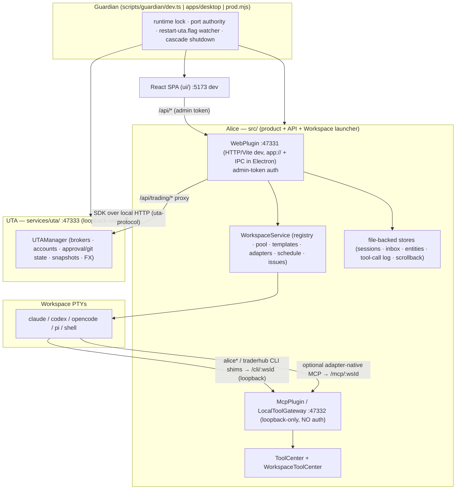
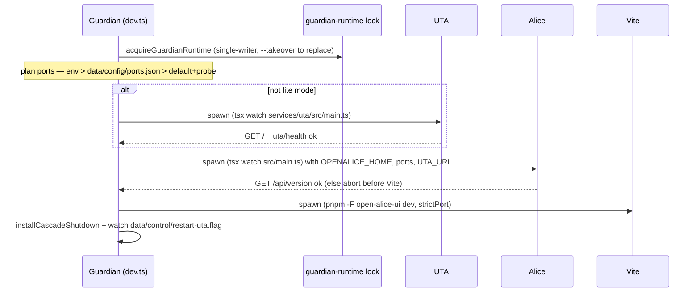
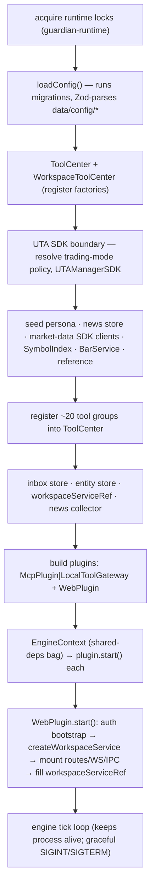
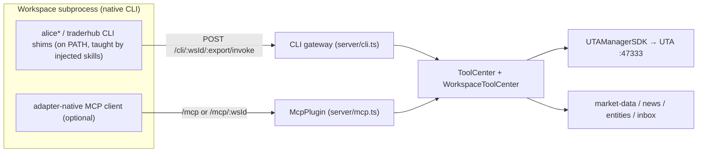
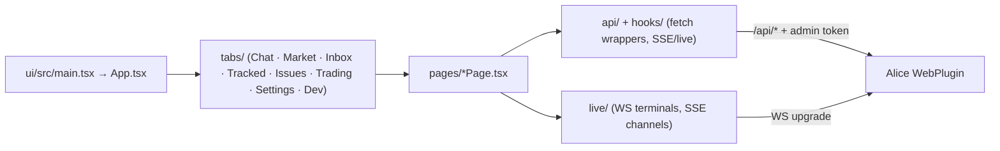
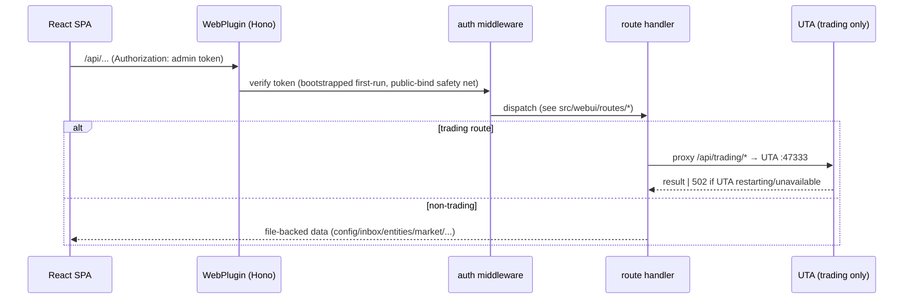
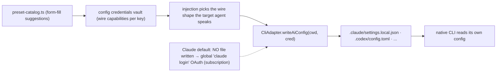
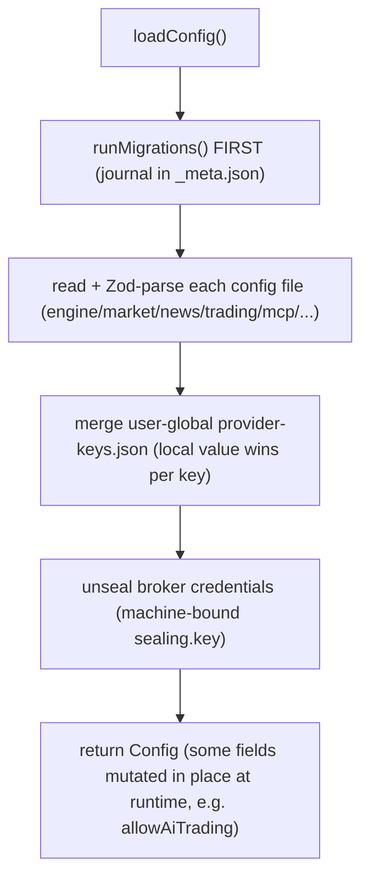

# Architecture Reference

A cross-cutting onboarding map for engineers new to OpenAlice. It links the
whole system together and points at the load-bearing code and the authoritative
owner guides. When this file and the code disagree, the code wins — verify the
runtime and update this map in the same change (the [owner-guide maintenance
rule](README.md#maintenance-rule) applies here too).

**Scope boundary.** This document explains *how the pieces fit and why*. It does
**not** restate the deep rules that live in the owner guides — process/state
ownership ([[docs/project-structure.md]]), branch/PR policy
([[docs/development-workflow.md]]), packaging/runtime
([[docs/managed-workspace-runtime.md]]), issues/scheduling
([[docs/workspace-issues-and-scheduling.md]]), market data
([[docs/market-data-architecture.md]]), and trading acceptance
([[docs/uta-live-testing.md]]). Those remain the source of truth for their scope.

---

## 1. The one idea that explains everything

OpenAlice does **not** run a model loop. The model loop runs inside native
coding-agent CLIs (`claude`, `codex`, `opencode`, `pi`). OpenAlice is the
*substrate* those agents operate on: a Workspace (directory + git repo + PTY),
file-backed state, market/trading tools exposed over local HTTP, and an
approval gate in front of anything money-capable.

Two consequences shape the entire codebase:

1. **There is no `AgentCenter` / prompt loop / `maxSteps` / `maxTurns` in
   `src/`.** The in-process AI loop was removed at 0.40 (see the note at
   [src/main.ts:8](../src/main.ts)). Autonomous work is *headless Workspace
   dispatch*: a schedule or issue spawns a native CLI in one-shot mode, the
   agent reports via `inbox_push`, and the process exits. Do not reintroduce a
   parallel workflow engine.
2. **Trading writes never live in Alice.** All broker state and every order is
   owned by a separate process (**UTA**). Alice only proxies.

---

## 2. Runtime topology

Two long-running services, supervised by a **Guardian** launcher, plus the Vite
dev server. Each Workspace additionally owns PTY subprocesses running the native
agent CLIs.



Load-bearing detail lives in [[docs/project-structure.md]]. UTA is **optional**:
`OPENALICE_LITE_MODE=1` (or a `lite` trading policy) skips it, and Alice stays
fully usable read-only; `/api/trading/*` reports the carrier unavailable.

---

## 3. Folder structure

```text
OpenAlice/
├── src/                         Alice process (the product + launcher)
│   ├── main.ts                  composition root & boot sequence (§4)
│   ├── core/                    config, paths, sealing, sessions, Inbox,
│   │                            entities, ToolCenter(s), tool-call log, migrations glue
│   ├── ai-providers/            provider/model PRESET catalog (suggestions only, no loop)
│   ├── domain/                  non-broker domains
│   │   ├── market-data/         equity/crypto/fx/etc clients, BarService, reference data
│   │   ├── analysis/            indicators / technical analysis
│   │   ├── news/                RSS collector + archive
│   │   └── thinking/            sandboxed expression evaluation
│   ├── tool/                    agent-facing tool definitions (register into ToolCenter)
│   ├── workspaces/              THE launcher: pool, PTYs, adapters, templates,
│   │   │                        issues, schedule, CLI shims, git/file ops
│   │   ├── adapters/            claude · codex · opencode · pi · shell (CliAdapter)
│   │   ├── templates/           chat (durable) + auto-quant (ephemeral)
│   │   ├── issues/ schedule/    markdown issue board + scanner (headless dispatch)
│   │   └── cli/                 alice, alice-uta, alice-workspace, traderhub shims
│   ├── server/                  MCP server + local CLI gateway + market-data compat mount
│   ├── webui/                   Hono routes, auth middleware, Workspace WS/IPC, SSE
│   ├── services/               auth · uta-client (SDK) · uta-supervisor · trading-mode
│   └── migrations/             versioned, journaled user-state migrations (§10)
├── services/uta/                UTA process — ALL broker/trading implementation
│   ├── src/main.ts              service composition root (§4)
│   ├── src/http/                /api/trading, /api/simulator, /__uta/health
│   └── src/domain/trading/      brokers, UTAManager, FX, snapshots, order-sync
├── packages/                    workspace packages (§7)
│   ├── guardian-runtime/        process ownership / single-writer locks / takeover
│   ├── uta-protocol/            shared Alice↔UTA schemas + SDK client
│   ├── ibkr/                    IBKR TWS protocol (owned by UTA)
│   └── opentypebb/              embedded market-data compatibility package
├── ui/                          React 19 + Vite 7 + zustand SPA
├── apps/desktop/                Electron main/preload/IPC shell (packaged Guardian)
├── scripts/guardian/            dev + prod supervisors and smoke tests
├── default/                     shipped skills, persona default, factory defaults
└── docs/                        owner guides (this file included)
```

---

## 4. Startup sequences

### 4.1 Guardian dev boot (`pnpm dev`)

[scripts/guardian/dev.ts](../scripts/guardian/dev.ts) is the port authority and
supervisor. UTA first (optional), then Alice, then Vite (needs Alice's port for
its proxy).



The **restart-uta.flag** is the only "event bus" left: Alice touches it after
broker-config changes, Guardian SIGTERMs UTA and respawns; Alice/Vite stay up
and `/api/trading/*` returns 502 until the new UTA is ready.

### 4.2 Alice composition root (`src/main.ts`)

[src/main.ts](../src/main.ts) wires everything with plain constructor injection —
no DI container. Order matters (later steps read earlier objects):



`EngineContext` (the shared-deps bag) is defined in
[src/core/types.ts](../src/core/types.ts). The `Plugin` interface
(`name`/`start`/`stop`) is the only lifecycle abstraction.

### 4.3 UTA boot (`services/uta/src/main.ts`)

`loadConfig` → `eventLog` + `ToolCenter` → `UTAManager` → purge ephemeral accounts
+ `initUTA` each survivor (one bad account never aborts boot) → FX (currency
client only) → snapshot service + scheduler → order-sync poller (10s fast lane /
15m external-order lane) → catalog refresh → Hono routes → bind loopback.
Startup **is** the reload path; there is no in-process hot reload.

---

## 5. Module boundaries & responsibilities

| Module | Owns | Must NOT |
|---|---|---|
| `src/core/` | config, paths, sealing, sessions, Inbox, entities, tool registries, tool-call log, migration glue | depend on `src/workspaces/` at runtime (uses structural types / lazy closures to avoid it) |
| `src/workspaces/` | Workspace lifecycle, PTY pool, adapters, templates, issues, schedule, headless dispatch, CLI shims, git/file ops | run a model loop; hardcode a CLI's behavior outside its adapter |
| `src/domain/market-data/` | data clients, `BarService` (K-lines), reference boards | write trading state |
| `src/tool/` | agent-facing `Tool` definitions | hold business state (thin bridges) |
| `src/server/` + `src/webui/` | MCP surface, CLI gateway, HTTP routes, auth, WS/IPC | implement trades (proxy to UTA) |
| `src/ai-providers/` | provider/model **preset catalog** (form-fill suggestions) | execute models |
| `services/uta/` | brokers, accounts, approval/git state, FX, snapshots, all trading writes | move state back into Alice |
| `packages/uta-protocol/` | shared Alice↔UTA wire schemas + SDK client | leak broker internals |
| `ui/` | React SPA rendering `/api/*` | assume UTA/broker health from Alice availability |

Detailed ownership and the change-routing table are in
[[docs/project-structure.md]].

---

## 6. The tool system (two registries)

This is the heart of "how agents act on OpenAlice". There are **two** registries
because the surfaces are genuinely different.

| | `ToolCenter` ([src/core/tool-center.ts](../src/core/tool-center.ts)) | `WorkspaceToolCenter` ([src/core/workspace-tool-center.ts](../src/core/workspace-tool-center.ts)) |
|---|---|---|
| Holds | concrete, identity-free `Tool`s | **factories** that bake a workspace identity into each `Tool` |
| Examples | trading, market, news, quant, thinking | `inbox_push`/`inbox_read`, `entity_upsert`/`entity_search`, `issue_*`, `workspace_path` |
| Identity | none | `workspaceId` injected server-side from the URL (`/mcp/:wsId`, `/cli/:wsId`) — agent never sees or supplies it → zero forgery surface |
| Filtering | disabled-tool list read from disk per request | rebuilt per request (disable + closure both live) |

Tools reach the agent by **two** paths:



The **CLI-shim path is primary** for launcher-created Workspaces — the launcher
injects *no* `.mcp.json` by default (see
[src/workspaces/context-injector.ts](../src/workspaces/context-injector.ts)); the
`alice`, `alice-uta`, `alice-workspace`, `alice-analysis`, and `traderhub`
skills teach the agent the shim surface. MCP remains an *optional*,
adapter-specific path (the Claude adapter still injects
`enableAllProjectMcpServers` for templates that ship a `.mcp.json`).

**Security posture:** the MCP/CLI listener (`:47332`) is **loopback-only and
unauthenticated by design** — its only callers are local Workspace subprocesses,
and the `:wsId` in the path is *routing, not a secret*. Never make it honor
`OPENALICE_BIND_HOST`. Remote/multi-user access is the web port's job, gated on
the admin token.

---

## 7. Shared packages (`packages/`)

| Package | Responsibility | Key notion |
|---|---|---|
| `@traderalice/guardian-runtime` | cross-launcher single-writer locks, heartbeat metadata, process identity, controlled `--takeover` | `guardian.lock` (launcher) + `runtime.lock` (writer); `onOwnershipLost` self-terminates |
| `@traderalice/uta-protocol` | Alice↔UTA schemas + `createUTAClient` SDK | the only sanctioned Alice→UTA contract |
| `@traderalice/ibkr` | IBKR TWS wire protocol | consumed only by UTA |
| `@traderalice/opentypebb` | embedded market-data query executor (`QueryExecutor`) | the private compatibility layer ([[docs/market-data-architecture.md]]) |

In dev/tests these are aliased to their `src/*.ts` entry points (see
[vitest.config.ts](../vitest.config.ts) and the `openalice-source` export
condition in [tsconfig.json](../tsconfig.json)); the build compiles them via
`turbo`.

---

## 8. Frontend architecture (`ui/`)

A single React 19 SPA built with Vite 7, state via **zustand** (no Redux/router
lib — see `ui/src/` `contexts/` + `tabs/` + `pages/`). It renders the Alice
`/api/*` contract and nothing else.



Two contract-preservation rules that bite if ignored:

- Any change to the `/api/*` contract **must** update the mock handlers in
  `ui/src/demo/` and be walked via `pnpm -F open-alice-ui dev:demo` (the demo
  surface is a first-class target, per [[AGENTS.md]]'s verification matrix).
- Workspace terminals use a **WS/IPC** transport (`src/webui/workspaces-ws.ts` /
  `workspaces-ipc.ts`), separate from the request/response `/api/*` routes.

---

## 9. Request, agent, and provider flows

### 9.1 HTTP request flow (including the trading proxy)



### 9.2 Agent execution — interactive vs headless

```mermaid
flowchart TB
  subgraph Interactive
    i1["UI New Session → WorkspaceService.pool"] --> i2["resolve CliAdapter (claude/codex/...)"]
    i2 --> i3["buildSpawnEnv + composeCommand (+ optional initialPrompt seed)"]
    i3 --> i4["spawn PTY (native CLI TUI)"]
    i4 --> i5["TranscriptWatcher discovers session id · ScrollbackStore replays"]
  end
  subgraph Headless
    h1["issue/schedule → ScheduleScanner"] --> h2["dispatchHeadlessTask (cap: 8 concurrent)"]
    h2 --> h3["composeHeadlessCommand → spawn CLI one-shot (stream-json)"]
    h3 --> h4["agent calls inbox_push → HeadlessTaskRegistry records run"]
    h4 --> h5["materialize run → durable Session (sourceRunId, idempotent)"]
  end
```



Three deliberately separate identities (do not conflate — see
[[docs/project-structure.md]]): `SessionRecord.id` (Alice's runtime/UI key),
`agentSessionId` (native CLI conversation id for resume), `sourceRunId` (headless
run → Session index). The full issue/schedule contract is in
[[docs/workspace-issues-and-scheduling.md]].

### 9.3 Provider selection & credential injection



The `CliAdapter` interface ([src/workspaces/cli-adapter.ts](../src/workspaces/cli-adapter.ts))
is the extension seam: `composeCommand` / `composeHeadlessCommand`,
`extractHeadlessSessionId` / `extractHeadlessAssistantText`, `bootstrap`,
`writeAiConfig`/`readAiConfig`, and transcript discovery. The **Claude
subscription path** writes no credential file unless a per-workspace override
exists — so `claude login` OAuth is inherited by default (no API key). See
[[docs/local-development.md]] and
[src/ai-providers/preset-catalog.ts](../src/ai-providers/preset-catalog.ts).

---

## 10. Configuration & persistence

### 10.1 Configuration loading

`loadConfig()` ([src/core/config.ts](../src/core/config.ts)) is Zod-schema-driven
over per-file JSON under `<OPENALICE_HOME>/data/config/`.



`OPENALICE_*` env vars are the real runtime knobs (there is no agent-loop
config); the dev-relevant subset is documented in [[docs/local-development.md]].
Data-vendor keys are user-global (portable across checkouts); broker credentials
stay **instance-local** because `data/` beside the source tree is the audit
boundary for money-capable state.

### 10.2 Persistence layer

Everything is files — no Postgres/Redis. Stores live in `src/core/`:
`SessionStore` (session.ts), `inbox-store`, `entity-store` (+ `entity-backlinks`),
`tool-call-log`, `media-store`, `scrollback-store` (workspaces), and UTA's
`event-log`. State layout (`data/`, `workspaces/`, `state/`, `provider-keys.json`,
`sealing.key`) is specified in [[docs/project-structure.md]]. `sealing.key`
deliberately lives *beside* `data/`, not inside it, so a copied backup carries no
decryption key.

### 10.3 Migration framework (state schema changes)

[src/migrations/runner.ts](../src/migrations/runner.ts) +
[registry.ts](../src/migrations/registry.ts): forward-only, journaled, snapshot
`data/config/` before each step; a throwing migration halts boot without
recording the id. **Rules:** never reorder or reuse an id; migrations must be
idempotent and declare `affects` for large trees; register in `registry.ts` then
run `pnpm build:migration-index`. IDs 0001–0007 are retired (pre-0.40 rebuilds
rather than migrates); numbering continues forward.

### 10.4 "Memory system"

OpenAlice's durable memory is not a vector DB — it is:

- **Tracked entities** — the cross-workspace graph (`entity-store` +
  `entity-backlinks`), written by agents via `entity_upsert`, linked with
  `[[wikilinks]]`, surfaced in the Tracked tab.
- **Inbox** — the durable agent→user delivery surface (`inbox-store`), written
  via `inbox_push`, stamped with run/session provenance server-side.
- **Persona** — `data/brain/persona.md` (falls back to
  `default/persona.default.md`), composed into each Workspace's `CLAUDE.md` /
  `AGENTS.md` at creation by the context-injector.

(The `.claude/mind.mv2` file at the repo root is a local Claude-Code plugin
store, gitignored — *not* part of OpenAlice's architecture.)

---

## 11. Extension points

| Want to add… | Do this | Anchor |
|---|---|---|
| A global agent tool | write a `Tool`, register a group in `main.ts` | [src/tool/](../src/tool) + [tool-center.ts](../src/core/tool-center.ts) |
| A workspace-scoped tool (identity baked in) | implement a `WorkspaceToolFactory`, register on `WorkspaceToolCenter` | [workspace-tool-center.ts](../src/core/workspace-tool-center.ts) |
| Support a new agent CLI | implement `CliAdapter`, register in `AdapterRegistry` | [cli-adapter.ts](../src/workspaces/cli-adapter.ts) |
| A new provider preset | add a `PresetDef` to the catalog | [preset-catalog.ts](../src/ai-providers/preset-catalog.ts) |
| A new HTTP surface | add a `create*Routes` module, mount in the web plugin | [src/webui/routes/](../src/webui/routes) + [plugin.ts](../src/webui/plugin.ts) |
| A Workspace shape | add a template (cross-platform `bootstrap.mjs`) | [src/workspaces/templates/](../src/workspaces/templates) |
| A user-state schema change | add an idempotent migration + spec | [src/migrations/](../src/migrations) |
| A new market-data domain | extend the client seam + BarService | [[docs/market-data-architecture.md]] |

New agent-facing *capabilities* normally ship as Workspace templates, skills, or
satellite repos — **not** as new engine machinery in `src/` ([[AGENTS.md]]).

---

## 12. Anti-patterns & technical debt

Observed in-tree; recorded so future work doesn't cargo-cult them.

- **Composition-root sprawl.** [src/main.ts](../src/main.ts) (~460 lines) wires
  everything by hand. Readable but load-bearing and easy to misorder; treat edits
  as surgical.
- **God-objects on the edges.** [src/webui/routes/workspaces.ts](../src/webui/routes/workspaces.ts)
  (~1.6k lines), [src/workspaces/service.ts](../src/workspaces/service.ts) (~1.4k),
  [src/core/config.ts](../src/core/config.ts) (~1.1k), and
  [src/tool/trading.ts](../src/tool/trading.ts) (~0.9k) exceed the repo's own
  size guidance. Split along seams when you touch them, don't rewrite wholesale.
- **Core↔workspaces coupling avoided via structural types.** `src/core/` reaches
  the workspace registry through structural interfaces + lazy closures
  (`makeWorkspaceResolver`, `WorkspaceServiceRef`) to prevent a hard dependency.
  Preserve that indirection; don't add a direct import.
- **Hand-synced enums (fixed 2026-07).** `WireShape` was duplicated between
  [preset-catalog.ts](../src/ai-providers/preset-catalog.ts) and
  [config.ts](../src/core/config.ts); it is now aliased type-only from core's
  `CredentialWireShape` (single source; core still has no ai-providers
  dependency). Preserve that direction.
- **Cross-plugin ref box.** `WorkspaceServiceRef` exists only because `McpPlugin`
  starts before `WebPlugin` creates the service. A `null` window exists at boot;
  callers guard for it (503 / loud skip).
- **Retired-but-resident code.** v1 `calculateIndicator` (`createAnalysisTools`)
  is deregistered from the tool surface but the code remains
  ([src/main.ts:264](../src/main.ts)); the legacy optional-plugin map is kept
  empty. Dead-ish, intentionally left.
- **Intentional `eval`.** [src/domain/thinking/tools/calculate.tool.ts](../src/domain/thinking/tools/calculate.tool.ts)
  uses `eval` for the sandboxed expression tool; esbuild warns on build. It is a
  deliberate, contained design — do not "fix" it without replacing the evaluator.
- **Windows test flake (fixed 2026-07).** `headless-task-registry.spec.ts`
  raced the registry's fire-and-forget log deletions during temp-dir cleanup
  (`ENOTEMPTY`); the spec's `rm` now retries (`maxRetries`). Other specs share
  the plain-`rm` cleanup pattern — a shared retrying helper is M0 work.

---

## 13. Change with extreme care (consequences beyond the diff)

These are structural invariants. Breaking one is silent and expensive.

1. **The Alice↔UTA boundary.** Broker state and every trading write live in
   `services/uta/`. Do not move them into Alice; do not treat Alice's
   availability as evidence a broker is healthy. ([[docs/uta-live-testing.md]])
2. **MCP/CLI gateway is loopback-only, unauthenticated *by design*.** Its safety
   is the loopback boundary. Never bind it publicly or honor
   `OPENALICE_BIND_HOST` there. Remote auth is the web port's job.
3. **No in-process model loop / no parallel workflow engine.** The loop is the
   native CLI's. Autonomous work is headless Workspace dispatch.
4. **Migrations are forward-only and idempotent.** Never reorder/reuse ids;
   always register + regenerate the index; snapshot semantics assume this.
5. **Secrets & sealing.** Broker/auth/provider material is sensitive; sealed at
   rest with a machine-bound `sealing.key` kept *outside* `data/`. Never write
   secrets to tracked files, logs, fixtures, or agent instructions.
6. **Chat Workspaces are durable; Auto-Quant Workspaces are ephemeral.** Do not
   apply one lifecycle to both, and do not reintroduce date-based automatic Chat
   Workspaces (a date is not a context boundary).
7. **Session identity triad.** Keep `SessionRecord.id`, `agentSessionId`, and
   `sourceRunId` distinct; never use a headless task id as a PTY/session id.
8. **Persona/instruction injection is golden-spec'd.** The context-injector
   reproduces prior output byte-for-byte and writes both `CLAUDE.md` and
   `AGENTS.md`; a workspace-creation spec asserts it.
9. **Guardian ownership model.** Single-writer locks + `onOwnershipLost`
   self-termination protect the file-backed store from concurrent writers across
   all three launchers ([packages/guardian-runtime/](../packages/guardian-runtime)).

---

## 14. Verification map (for changes, not just reading)

`pnpm typecheck` + `pnpm test` always. Then add the surface-specific checks from
the matrix in [[AGENTS.md]] (UI build + demo walk, package typechecks, UTA live
scenarios on paper/demo accounts, Guardian recovery, Electron smokes, migration
index). The dev stack itself boots green under `pnpm test:smoke`.
