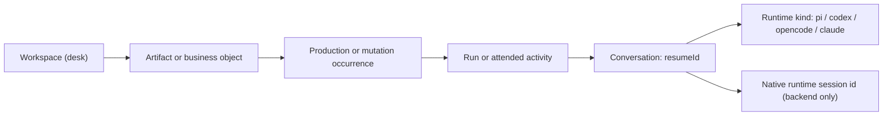

# Conversation Identity and Follow-up Provenance

This guide owns the identity model behind “ask the agent who produced this.” It
defines what the user is asking about, which OpenAlice object is the answer
target, and which identifiers may cross product, CLI, and runtime boundaries.

Related guides: [[docs/project-structure.md]] and
[[docs/workspace-issues-and-scheduling.md]]. This is a provenance/indexing
contract, not a revival of the retired event-bus scheduler described in
[[docs/event-system.md]].

## The Core Distinction

A user normally starts from a **business object**, but the thing that can answer
is a **conversation**:



- A Workspace is a context and capability boundary. It is not a person.
- An Issue, Inbox entry, report, or trade decision is what is being questioned.
- A run/activity says which occurrence produced or changed that object.
- `resumeId` identifies the stateful conversation that can be asked.
- `pi`, `codex`, `opencode`, and `claude` are runtime kinds, not unique agents.
- A native runtime session id is an implementation locator, not product identity.

In the office analogy, the Workspace is the desk, `agent` is the kind of worker,
and `resumeId` is the particular colleague-with-context. Starting another Pi in
the same Workspace creates a different colleague. Continuing one `resumeId`
through multiple processes or headless turns keeps talking to the same colleague.

## Identity Ladder

| Identity | Meaning | Uniqueness and lifetime | Product follow-up target? |
|---|---|---|---|
| `workspaceId` | One durable desk/context | Global in one OpenAlice root; outlives processes | No; fallback location only |
| `{ workspaceId, issueId }` | One Workspace-owned Issue | `issueId` is local to a Workspace | No; the object being discussed |
| `inboxEntryId` | One immutable delivery occurrence | Global UUID in the Inbox store | No; resolves to provenance |
| `taskId` / `runId` | One headless execution/turn | Global UUID; append-only history | No; execution evidence |
| `parentTaskId` | Previous turn in one run chain | Direct lineage only | No |
| `resumeId` | One OpenAlice-owned conversation | Global, stable across headless and interactive turns | **Yes** |
| `SessionRecord.id` | Durable interactive UI/PTY wrapper | Global launcher record; may materialize a conversation | No |
| `agent` | Runtime adapter kind | Repeated across many Workspaces and conversations | No |
| `(agent, agentSessionId)` | Native CLI conversation locator | Backend/vendor scoped; may change with runtime behavior | Never public |
| PID/live PTY | Current process incarnation | Ephemeral | Never |

`ResumeRegistry` binds one `resumeId` immutably to one `workspaceId` and one
runtime kind, and may later learn or refresh its native session locator. A
`resumeId` must never be reassigned to another Workspace or runtime.

## What “Ask About This” Can Mean

The caller must identify both the object and the relationship it cares about.
These questions are not interchangeable:

1. **Ask the producer of this delivery** — who wrote/pushed this exact Inbox
   message or report occurrence?
2. **Ask the creator of this durable object** — who originally created this
   Issue, document, or thesis?
3. **Ask the author of the current version** — who made the mutation containing
   the text/value the user sees now?
4. **Ask the executor of a specific run** — why did the 10 July run reach this
   result?
5. **Ask the latest executor** — what does the most recent successful run think?
6. **Ask the owning desk to reconstruct** — no attributable conversation is
   available; start a new conversation in the Workspace and inspect its files.

A single `resumeId` field on a mutable Issue cannot answer all six. Creation,
mutation, and repeated execution are separate provenance occurrences and can
belong to different conversations or a human.

## Resolution Contract

Every follow-up resolver should report how it chose the answerer:

```ts
type FollowUpResolution =
  | {
      mode: 'exact'
      resumeId: string
      workspaceId: string
      agent: string
      evidence: ProductionRef
    }
  | {
      mode: 'inferred'
      resumeId: string
      workspaceId: string
      agent: string
      evidence: ProductionRef
      reason: 'latest-successful-run' | 'latest-mutation'
    }
  | {
      mode: 'unavailable'
      attributedResumeId?: string
      workspaceId?: string
      agent?: string
      evidence?: ProductionRef
      reason: 'missing-conversation' | 'missing-native-session' | 'deleted-workspace'
    }
  | {
      mode: 'reconstructed'
      workspaceId: string
      preferredAgent?: string
      reason: 'missing-origin' | 'unavailable-origin' | 'external-origin'
    }
```

- `exact` means an immutable provenance edge names the producing conversation.
- `inferred` means OpenAlice followed an explicit policy such as “latest
  successful run.” It must not be presented as the original author.
- `unavailable` preserves attribution when the original conversation cannot be
  resumed. It may offer reconstruction as a separate next action.
- `reconstructed` starts a new conversation at the owning desk. Its answer is a
  fresh reading of available material, not testimony from the producer.

Missing or unresumable exact provenance may offer reconstruction, but must not
silently downgrade to it. The UI/CLI response should preserve the mode so an
agent cannot accidentally tell the user “I asked the author” when it did not.

## Logical Provenance Index

The logical index is a set of immutable attribution edges. Its persistence can
be implemented per owning subsystem, but every surface should project the same
shape:

```ts
type ArtifactRef =
  | { kind: 'inbox'; inboxEntryId: string }
  | { kind: 'issue'; workspaceId: string; issueId: string }
  | { kind: 'document'; workspaceId: string; path: string; revision?: string }
  | { kind: 'trade-decision'; accountId: string; decisionId: string }

type ProductionRef =
  | { kind: 'run'; taskId: string }
  | { kind: 'interactive'; sessionRecordId: string }
  | { kind: 'human' }
  | { kind: 'external'; system: string }

interface ProvenanceEdge {
  artifact: ArtifactRef
  action: 'created' | 'updated' | 'reported' | 'decided' | 'executed'
  source: ProductionRef
  workspaceId?: string
  resumeId?: string
  agent?: string
  at: number
}
```

The source is authoritative; `resumeId` and `agent` are safe denormalized lookup
keys stamped by OpenAlice. Native runtime ids never appear in an artifact,
public API, Inbox payload, Issue file, or Workspace CLI result.

Mutable objects need more than one edge. For example, an Issue may have
`created`, several `updated` occurrences, and many scheduled `reported`
occurrences. Consumers select the edge matching the user's question instead of
overwriting a single “owner conversation.”

The resolver follows four indexes in order:

1. **Surface -> artifact**: Inbox row, Issue route, document path/revision, or
   order/decision handle becomes a typed `ArtifactRef`.
2. **Artifact + intent -> occurrence**: select `created`, a specific `reported`
   run, `latest-mutation`, or another explicit relationship.
3. **Occurrence -> conversation**: authoritative run/session context yields
   `resumeId`, Workspace, and runtime kind.
4. **Conversation -> transport**: `ResumeRegistry` privately resolves the native
   CLI session needed to continue it.

Reverse indexes (`resumeId -> produced artifacts`, `taskId -> deliveries`) are
useful for audit and UI activity feeds, but they do not change the forward
follow-up semantics.

## Concrete Cases

### 1. Scheduled report delivered to Inbox

An Issue fires a headless `taskId`; the run receives a `resumeId` and pushes an
Inbox entry. “Why did this report say WIND-DOWN?” resolves:

```text
Inbox entry -> originating taskId -> resumeId -> exact Pi conversation
```

This is an exact producer question. Later follow-up turns get new `taskId`s but
keep the same `resumeId`.

### 2. One recurring Issue, many workers

A recurring financial/industrial scan can have earlier Codex runs and later Pi
runs. Three plausible questions resolve differently:

- “Why was this scan created?” -> the Issue `created` edge.
- “Why did yesterday's report pass?” -> that report/run's edge.
- “What does the latest run think?” -> explicitly inferred latest successful run.

The Issue's configured `agent` controls a future scheduled execution. It does
not identify the creator, previous reporter, or a unique AI.

### 3. Issue created during an attended chat

Today an Issue file records `assignee: ws:<workspace>` but not the creating
conversation. An accompanying Inbox message may reveal the interactive Session,
but that is circumstantial and disappears when no message was sent. Reliable
“why does this Issue exist?” therefore requires an immutable creation edge
stamped when `issue_create` or the UI mutation seam writes the file.

Direct file edits remain valid and cannot always identify an AI. They should be
recorded as human/unknown or recovered from a committed revision when possible,
never attributed to the Workspace's default runtime by guesswork.

### 4. Inbox points to a live document

Inbox document links intentionally render the current Workspace file. The
conversation that pushed the Inbox item can explain “why did you send this
then,” but it may not have authored the file's current contents after later
edits. “Why does the current file say this?” requires a document revision or
latest-mutation edge. Without one, resolution must say it is reconstructing.

### 5. Legacy/manual delivery with no origin

An older or manual Inbox entry may contain only `workspaceId`. There is no exact
AI to resume. OpenAlice may start a new worker at that Workspace, but the result
is `mode: 'reconstructed'` and should include the files it inspected as evidence.

### 6. “Why was this trade so bad?”

A broker order has at least two distinct causes:

- the **decision**: the conversation that proposed/staged the trade;
- the **execution**: human approval, UTA operation, broker routing, and fills.

The AI follow-up target is the decision conversation. Execution questions belong
to UTA/broker evidence. Current trading records do not carry an OpenAlice
`resumeId`/`taskId` decision edge, so an order cannot yet be attributed safely.
That link must cross the Alice -> UTA request as non-authoritative correlation
metadata without moving broker state or trading authority back into Alice.

## Invariants

1. Product and Workspace CLI callers exchange `resumeId`, never native session
   ids.
2. `taskId` identifies one execution; it is evidence, not the conversation.
3. `issueId` is never global without `workspaceId`.
4. Runtime kind and Workspace default are selection policy, not identity.
5. Provenance is server-stamped from authoritative spawn/session context; an
   agent cannot claim another identity in tool arguments.
6. Mutable artifacts retain multiple action edges instead of replacing their
   creator with the latest worker.
7. Deletion or an unavailable native session makes an exact target
   unresumable; it does not erase the historical attribution.
8. Existing UUID `resumeId`s remain valid. Human-readable ids apply only to new
   identities.
9. Only one turn may actively continue a `resumeId` at a time.
10. A fallback must disclose `reconstructed`; no surface may imply that a new
    worker is the original author.

## Current Coverage and Next Seams

The current code already has most execution/conversation indexes:

- `HeadlessTaskRegistry`: `taskId -> resumeId/workspaceId/agent/issueId`;
- `ResumeRegistry`: `resumeId -> workspaceId/agent/native session`;
- `SessionRegistry`: interactive wrapper and `resumeId/sourceRunId` indexes;
- Inbox origin: server-stamped headless/interactive production source;
- Issue detail: `{ workspaceId, issueId } -> runs + Inbox reports`.

The missing semantic seams are:

1. a shared resolver/result type that preserves `exact | inferred |
   reconstructed`;
2. Issue creation and mutation provenance (not merely Workspace-level author
   text);
3. document revision/mutation attribution when asking about current content;
4. trade-decision correlation from Alice conversation to UTA operation/order;
5. business-level convenience commands (`inbox ask`, `issue ask`) built on the
   generic resolver, rather than each surface inventing identity rules.

Define and test the resolver before adding one-click UI actions. Otherwise each
surface will silently choose a different meaning of “the agent who made this.”

## Load-Bearing Paths

| Path | Responsibility |
|---|---|
| `src/workspaces/resume-registry.ts` | Product conversation -> native runtime mapping |
| `src/workspaces/headless-task-registry.ts` | Per-execution history and conversation lineage |
| `src/workspaces/session-registry.ts` | Durable interactive wrappers and resume indexes |
| `src/core/inbox-store.ts` | Immutable delivery records and production provenance |
| `src/server/inbox-origin.ts` | Server-side run/session attribution |
| `src/workspaces/issues/declaration.ts` | Workspace-local Issue identity and content |
| `src/workspaces/issues/mutate.ts` | Shared Issue mutation seam |
| `src/workspaces/issues/board.ts` | Issue/run/Inbox projections |
| `src/workspaces/service.ts` | Headless dispatch and resume concurrency |
| `src/services/uta-client/` | Future Alice -> UTA decision-correlation boundary |
| `services/uta/src/domain/trading/` | Broker operation and execution authority |
