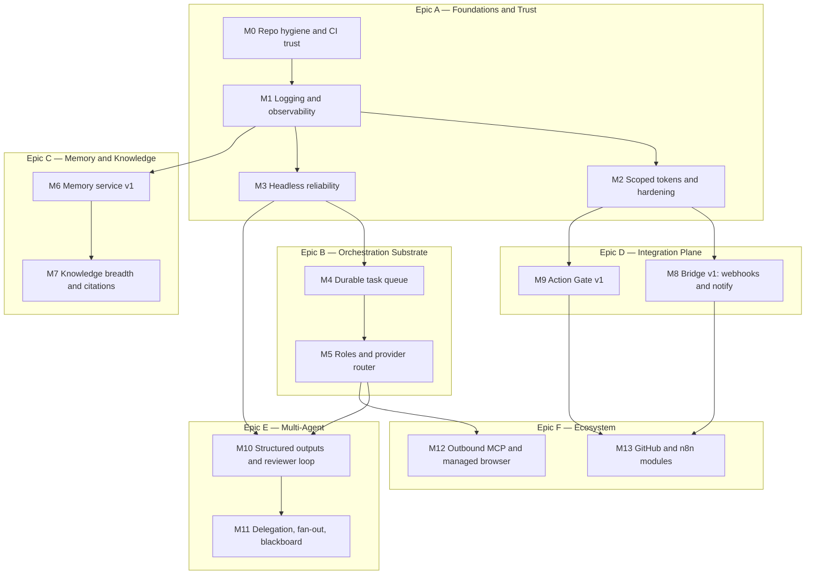

# Implementation Plan

**Status: planning surface.** Executable synthesis of the five design
documents: [[docs/architecture.md]] (current state), [[docs/roadmap.md]]
(costed ideas, IDs like `SE-2`), [[docs/ai-os-design.md]] (target
architecture), [[docs/knowledge-system.md]] (memory plane), and
[[docs/multi-agent.md]] (orchestration). Current code overrides this prose.

**How to execute this plan.** Milestones are strictly ordered by the
dependency DAG below; within a milestone, issues are independent unless noted.
Every issue is written to be executable by an engineer or an AI agent without
reading the design docs first (context is inlined). Work happens on feature
branches → PRs to `dev` per [[docs/development-workflow.md]]; every PR runs
`pnpm typecheck` + `pnpm test` plus the milestone's testing strategy.

---

## 1. Milestone Map



Effort legend: engineer-focused days (d) / weeks (w). Estimates assume one
engineer + AI agents; parallel epics (C alongside B/D) shorten wall-clock.

| Milestone | Effort | Unlocks |
|---|---|---|
| M0 | 1w | trustworthy CI, enforced conventions |
| M1 | 1.5w | debuggable everything |
| M2 | 2w | any remote/integration work |
| M3 | 1.5w | automation you can trust |
| M4 | 2w | all orchestration |
| M5 | 2w | specialized agents |
| M6 | 3w | semantic memory |
| M7 | 3w | citable knowledge, all types |
| M8 | 2w | event-driven + push notify |
| M9 | 2w | safe irreversible actions |
| M10 | 2.5w | quality-gated agent output |
| M11 | 2.5w | true multi-agent plans |
| M12 | 2w | browser + external MCP tools |
| M13 | 2.5w | GitHub/n8n ecosystem |

---

## 2. Milestones

### M0 — Repo Hygiene & CI Trust *(Epic A · 1w · depends: —)*

**Objectives.** CI is 100% believable on all OSes; conventions are enforced by
tools, not vigilance. (Roadmap: TE-1, DX-1, DX-2, SE-4, SE-5, TE-2.)

**Files affected.**
- new: `biome.json`, `lefthook.yml`, `.github/workflows/` lint+audit steps
- `package.json` (lint scripts), `vitest.setup.ts` / new `test/fs-utils.ts`
  (retrying `rm` helper), `src/workspaces/headless-task-registry.spec.ts`
- touched broadly once: mechanical `pnpm lint --write` commit (isolated, no
  logic changes)

**Testing strategy.** CI matrix ×3 OS green ×3 consecutive runs (flake gone);
lint job fails on a seeded violation; gitleaks catches a seeded fake key in a
test branch; coverage report published on PRs.

**Rollback.** Tooling-only: revert the PRs. The mechanical format commit is
isolated so a revert doesn't drag logic changes.

**Acceptance criteria.**
- [ ] `pnpm lint` exists, passes, and gates CI on all three OSes
- [ ] `headless-task-registry` spec passes 20/20 repeated runs on Windows CI
- [ ] pre-commit runs lint + typecheck-changed + gitleaks in < 10s typical
- [ ] `pnpm audit`/osv job fails PRs on high-severity findings
- [ ] CONTRIBUTING/local-development updated (one paragraph each)

---

### M1 — Structured Logging & Observability *(Epic A · 1.5w · depends: M0)*

**Objectives.** One structured logging spine (pino) across Alice; Prometheus
metrics; crash bundles; kill the `WireShape` duplication. (DX-3, IN-1, IN-2,
DX-6.)

**Files affected.**
- new: `src/core/logger.ts` (pino sink, level env, pretty dev transport),
  `src/webui/routes/metrics.ts`
- replace ~75 `console.*` across `src/` (mechanical, scripted, reviewed)
- `packages/uta-protocol/src/` or new tiny `packages/shared-types/` hosting
  `WireShape`; update `src/ai-providers/preset-catalog.ts`,
  `src/core/config.ts`
- `scripts/guardian/shared.ts` (child log prefix passthrough)

**Testing strategy.** Unit: logger level/redaction specs. Grep-gate in lint
config: `console.*` banned in `src/` (allowlist: guardian scripts). Metrics
endpoint scrape asserted in a spec; `pnpm test:smoke` output still readable.

**Rollback.** Logger wraps console at level=info by default — env
`OPENALICE_LOG_LEVEL` reverts verbosity; metrics route behind
`config.metrics.enabled` (default on, one-line off).

**Acceptance criteria.**
- [ ] zero raw `console.*` in `src/` (lint-enforced)
- [ ] `GET /api/metrics` exposes runs/tool-calls/queue-depth/uta-health
- [ ] crash bundle command exports last N log ring + versions + config shape (secrets redacted)
- [ ] `WireShape` defined once, imported everywhere, spec asserts single source

---

### M2 — Scoped Tokens & Security Hardening *(Epic A · 2w · depends: M1)*

**Objectives.** Replace single admin token with scoped tokens; rate-limit
auth; append-only audit chain for sensitive actions. (SE-1, SE-2, SE-3.)

**Files affected.**
- `src/services/auth/token-store.ts` (+ scopes: `read`, `enqueue`,
  `gate:approve`, `admin`), `src/services/auth/index.ts`
- `src/webui/middleware/auth.ts` (scope checks per route group)
- new: `src/core/audit-chain.ts` (hash-linked JSONL under `data/audit/`),
  `src/webui/routes/tokens.ts` (mint/revoke UI+API)
- new migration `0014_scoped_tokens` (wrap existing token as `admin`)
- `ui/src/pages/SettingsPage.tsx` (token management), `ui/src/demo/` handlers

**Testing strategy.** Route-matrix spec: every `/api/*` group × every scope →
expected 200/403 (table-driven, fails on unmapped new routes). Rate-limit spec
(burst → 429 → lockout window). Audit chain: tamper detection spec (mutate a
line → verification fails). Migration spec + `pnpm build:migration-index`.

**Rollback.** Migration snapshot restores `auth.json`; legacy admin token
keeps working throughout (scopes are additive); rate limiter behind config
with safe defaults.

**Acceptance criteria.**
- [ ] tokens carry scopes; admin token = `admin` scope; UI can mint read-only token
- [ ] unmapped-route test fails if a new route lacks a scope declaration
- [ ] 20 bad auth attempts → 429 + lockout, logged with source IP
- [ ] audit chain verifies end-to-end; trading approve/reject writes to it

---

### M3 — Headless Reliability *(Epic A · 1.5w · depends: M1)*

**Objectives.** Headless runs never zombie, classify their outcomes, and
retry sanely. (AG-2, AG-3, AG-6, AU-4, AU-7.)

**Files affected.**
- `src/workspaces/headless-task.ts` (heartbeat from stream-json activity,
  timeout kill), `src/workspaces/headless-task-registry.ts` (outcome class:
  `success | no-report | error | timeout`)
- `src/workspaces/schedule/scanner.ts` + `declaration.ts` (retry frontmatter:
  `retries`, `backoff`; market-calendar skip via existing calendar clients;
  `--dry-run` snapshot mode)
- `src/webui/routes/headless.ts`, `ui` run views + demo handlers

**Testing strategy.** Fake-adapter specs (stalled stream → timeout kill;
non-zero exit → error class; report → success). Scanner specs for
retry/backoff/calendar-skip. E2E: `pnpm test:smoke` extended with one
deliberately-hanging headless run that gets reaped.

**Rollback.** Timeout/retry defaults conservative (30m, 0 retries) —
per-issue frontmatter opts in; classification is additive metadata.

**Acceptance criteria.**
- [ ] a hung CLI is killed at timeout and the run shows `timeout` with log tail
- [ ] `retries: 2` re-dispatches with backoff and stops after success
- [ ] weekend/holiday fires skipped for calendar-scoped schedules (logged)
- [ ] dry-run prints next-7-days fire plan without executing

---

### M4 — Durable Task Queue *(Epic B · 2w · depends: M3)*

**Objectives.** Replace the flat 8-cap dispatch with the file-backed queue:
lanes, priorities, retries, crash-safe claims, chaining. (ai-os-design § 5;
AU-3, AU-5.)

**Files affected.**
- new: `src/workspaces/queue/` (store: `data/queue/{pending,running,done}`,
  claim-by-rename, lanes.json, dispatch loop), migration `0015_task_queue`
  (drain-and-adopt HeadlessTaskRegistry records)
- `src/workspaces/service.ts` (dispatchHeadlessTask → enqueue),
  `src/workspaces/schedule/scanner.ts`, `src/webui/routes/headless.ts`
- `ui` queue view (pending/running/done with lane badges) + demo handlers

**Testing strategy.** Property-ish specs on the claim protocol (concurrent
claimers, only one wins — rename atomicity). Crash-recovery spec (running/
entry with dead pid re-queues attempt+1). Lane serialization spec. Chain spec
(`onSuccess` enqueues). Guardian smoke unchanged.

**Rollback.** Migration snapshot; the queue module keeps the old cap semantics
under `lanes.json` default (one global lane, cap 8) so behavior-compatible
rollback = default config.

**Acceptance criteria.**
- [ ] two dispatchers cannot double-claim (spec with 100 iterations)
- [ ] kill -9 during a run → next boot re-queues it exactly once
- [ ] per-workspace serial lane: two issues in one ws never run concurrently
- [ ] `chain.onSuccess` fires; `depends_on` gating holds work back

---

### M5 — Roles & Provider Router *(Epic B · 2w · depends: M4)*

**Objectives.** Ship the five role templates (Coder, Researcher, Planner,
Documenter, Reviewer), per-workspace tool-permission profiles, and
injection-time provider routing with budgets. (AG-1, AG-5, AI-1, AI-3.)

**Files affected.**
- new templates: `src/workspaces/templates/{coder,researcher,planner,documenter,reviewer}/`
  (instruction.md, manifest with role metadata + profile + routing class)
- new: `src/workspaces/permission-profiles.ts`; enforcement in
  `src/server/cli.ts` + `src/server/mcp.ts` (filter tool groups per wsId)
- new: `src/core/routing.ts` (`data/config/routing.json`, class→cred+model),
  wired into `src/workspaces/credential-injection.ts`
- cost accounting: parse usage from stream-json in `headless-task.ts`, store
  per-run; budgets in routing config
- `ui`: role picker on workspace create, routing settings + demo handlers

**Testing strategy.** Profile spec matrix (role × tool group → allowed?).
Injection specs per adapter (routing class resolves to expected
model/credential, issue-frontmatter override wins). Template golden specs
(workspace-creation spec pattern already exists). Budget spec (trip → degrade
deep→cheap, notify).

**Rollback.** Profiles default `unrestricted` for existing workspaces (only
new role-templates opt in); routing absent → today's behavior (lastModel →
vendor flagship).

**Acceptance criteria.**
- [ ] a researcher workspace cannot invoke trading tool groups (403 at gateway, spec'd)
- [ ] `class: cheap` issue runs on the configured economical model
- [ ] per-run token/cost visible on the run record and Inbox entry
- [ ] all five templates create + boot + report via the golden spec

---

### M6 — Memory Service v1 *(Epic C · 3w · depends: M1; parallel with B/D)*

**Objectives.** The optional 4th process: local embeddings, LanceDB index,
ingest journal, `memory_recall`, md+pdf converters, fs-source incremental.
(knowledge-system §§ 4–6 phase 1; ME-1, ME-2.)

**Files affected.**
- new: `services/memory/` (main.ts, http routes `/recall` `/ingest`
  `/__memory/health`, embedder, lance store, journal, converters md/pdf,
  chunkers), new `packages/knowledge-protocol/`
- guardian: `scripts/guardian/dev.ts` + `shared.ts` (4th child, optional,
  `OPENALICE_MEMORY_PORT`), `apps/desktop` spawn parity
- Alice: new `src/tool/memory-recall.ts` (WorkspaceToolCenter factory with
  substring-search fallback + `degraded` flag), `src/services/memory-client/`
- state: `data/knowledge/{library,index}`, migration `0016_knowledge_dirs`
- docs: state layout in [[docs/project-structure.md]] (same change)

**Testing strategy.** Converter/chunker unit specs with fixture pdfs/mds.
Journal incremental spec (hash-unchanged → no re-embed). Recall relevance
smoke (seeded corpus, top-1 assertions). Degradation spec (service down →
fallback + flag). Guardian smoke gains the 4th child (skippable env).
`alice kb rebuild` spec: delete index → rebuild → identical recall results.

**Rollback.** Service is optional-by-config (default off until M7 hardens it);
`memory_recall` falls back automatically; index is derived — deleting
`data/knowledge/index/` is always safe.

**Acceptance criteria.**
- [ ] entities+inbox+notes+a PDF are recallable with source pointers
- [ ] editing a note re-indexes only that doc (journal spec)
- [ ] Memory down → `memory_recall` still answers (substring, `degraded: true`)
- [ ] full rebuild from library is one command and converges

---

### M7 — Knowledge Breadth & Citations *(Epic C · 3w · depends: M6)*

**Objectives.** docx/xlsx/image/code/git converters, tree-sitter chunking,
`alice://kb/` citation resolution end-to-end, Inbox provenance chips.
(knowledge-system phases 2–3; KB-5.)

**Files affected.**
- `services/memory/converters/{docx,xlsx,image,code}.ts`, `sources/git.ts`
  (commit-diff incremental), chunkers (`tree-sitter` wasm)
- Alice: `src/webui/routes/knowledge.ts` (`/api/knowledge/search`, citation
  resolve), researcher skill update (`sources:` contract),
  `src/core/inbox-store.ts` (citations field)
- `ui`: knowledge search page, provenance chips on Inbox + demo handlers

**Testing strategy.** Fixture battery per format (a real xlsx, docx, png with
text, a small git repo fixture). Citation round-trip spec (report cites →
resolve → exact locator). Supersede-chain spec (re-ingest changed pdf → old
citation still resolves, flagged superseded).

**Rollback.** Each converter registers independently — disable per type in
`sources.json`; citations field is additive to inbox schema.

**Acceptance criteria.**
- [ ] all 9 source types ingest and recall with correct locators
- [ ] a git-source commit re-indexes only changed paths (spec)
- [ ] Inbox report renders clickable citations resolving to page/range/lines
- [ ] researcher skill rejects (loud lint) reports without `sources:`

---

### M8 — Bridge v1: Webhooks & Notify *(Epic D · 2w · depends: M2)*

**Objectives.** The 5th (optional) process: HMAC inbound webhooks → enqueue
mapped issues; outbound notifications (Telegram first) + signed webhooks-out
for Inbox events. (ai-os-design § 10; AU-1, AU-6, N8-2.)

**Files affected.**
- new: `services/bridge/` (main.ts, `hooks/` inbound with per-hook HMAC,
  `notify/` telegram via existing grammy dep, `webhooks-out/`), new
  `packages/bridge-protocol/` (hook config, event payload schemas)
- guardian 5th child (optional); Alice: enqueue endpoint accepting `enqueue`
  scope (from M2), inbox event emission hook
- config: `data/config/bridge.json` (+ migration `0017_bridge_config`),
  sealed channel creds
- `ui`: integrations settings page + demo handlers

**Testing strategy.** HMAC spec (bad sig → 401, replay window). End-to-end
spec with an in-test HTTP hook: POST → issue enqueued → (fake) run →
inbox → webhook-out delivered signed. Notify adapter contract test with a
mock Telegram server. Blast-radius spec: bridge token cannot hit non-enqueue
routes (reuses M2 matrix).

**Rollback.** Whole service off by default; per-module toggles; revoking the
bridge token severs it instantly (documented as the incident response).

**Acceptance criteria.**
- [ ] curl with valid HMAC → named issue enqueued with `source: webhook`
- [ ] Inbox arrival → Telegram message with report link
- [ ] webhook-out is HMAC-signed and n8n-consumable (fixture asserted)
- [ ] bridge holds only an `enqueue`+`read` scoped token (matrix spec)

---

### M9 — Action Gate v1 *(Epic D · 2w · depends: M2)*

**Objectives.** Generalized approval workflow for non-trading irreversible
actions: proposal files, approve/deny surfaces, audit append, two gated tools
(external git push, publish). (ai-os-design § 9.)

**Files affected.**
- new: `src/core/action-gate.ts` (`data/gate/{pending,resolved}`), gated-tool
  wrapper in `src/core/workspace-tool-center.ts` path,
  `src/webui/routes/gate.ts`
- profiles from M5 declare `gated:` tool lists; audit chain from M2 records
  decisions
- `ui`: approvals in notification center + demo; notify via M8 when present

**Testing strategy.** Gate spec: gated call → proposal created, tool NOT
executed; approve → captured call executes once (idempotency spec); deny →
never executes; audit entries verify. Auto-approve allowlist spec.

**Rollback.** Zero tools gated by default — gating is opt-in per profile;
emptying the `gated:` list restores direct execution.

**Acceptance criteria.**
- [ ] a gated `git push` from an agent produces a proposal, not a push
- [ ] approval executes exactly once; denial reports back via Inbox
- [ ] every decision lands in the tamper-evident audit chain
- [ ] auto-approve allowlist honored and logged

---

### M10 — Structured Outputs & Reviewer Loop *(Epic E · 2.5w · depends: M4, M5)*

**Objectives.** Schema-validated agent outputs per role; Conductor v1 = the
pairwise producer→reviewer state machine with bounded revisions.
(multi-agent §§ 2, 9–10; AI-2, MA-1.)

**Files affected.**
- new: `src/core/output-schemas.ts` (per-role zod: brief/plan/design-note/
  change-set/verdict/…), validation in `inbox_push` (schema by declared type)
- new: `src/workspaces/conductor/` (node states, advancement table,
  journal beside queue), review edges in issue frontmatter (`review: reviewer`)
- reviewer template refinement (verdict contract), `ui` plan/verdict views +
  demo handlers, migration `0018_conductor_state`

**Testing strategy.** Schema specs (valid/invalid payload matrices).
Conductor table-driven spec: every (state, event) → expected transition —
exhaustive by construction (multi-agent § 9 table). Revision-cap spec
(2×revise → escalated Inbox item). Integration: fake-adapter pipeline
producer→reviewer→approve end-to-end.

**Rollback.** Issues without a `review:` edge behave exactly as today;
validation is warn-only for one release (`strictOutputs` config) before
becoming enforcing.

**Acceptance criteria.**
- [ ] invalid report payload → run classified `no-report`, retried per M3
- [ ] revise verdict re-enqueues producer with findings attached as comment
- [ ] revision cap escalates to a human Inbox decision item
- [ ] Conductor state survives process restart mid-plan (journal spec)

---

### M11 — Delegation, Fan-out & Blackboard *(Epic E · 2.5w · depends: M10)*

**Objectives.** Provenance-stamped delegation, matrix fan-out with
aggregation, depth/width caps, blackboard claims + reconciliation.
(multi-agent §§ 5–6; MA-2, MA-3, MA-4.)

**Files affected.**
- `src/tool/issue-tools.ts` (delegation fields, role targeting),
  `src/workspaces/conductor/` (matrix expansion, aggregation nodes, caps,
  reconciliation-issue trigger)
- entity store extension: claim record type + stances
  (`src/core/entity-store.ts`, migration `0019_blackboard_claims`)
- role skills update (delegation + claim discipline), `ui` claim views

**Testing strategy.** Cap specs (depth 3 / width 16 → escalate, never
improvise). Fan-out spec (matrix of 5 → 5 children + 1 aggregation gated on
all). Contradiction spec (contradicts-stance claim → reconciliation issue →
verdict updates claim status). Provenance spec (delegatedBy stamped
server-side, agent-supplied value ignored).

**Rollback.** All additive frontmatter/record types; caps config-tunable to 0
(= delegation disabled) as the kill switch.

**Acceptance criteria.**
- [ ] fan-out over a ticker list produces per-ticker runs + one aggregate report
- [ ] recursive delegation stops at depth cap with an escalation item
- [ ] a contradicted accepted claim converges via reconciliation verdict
- [ ] dissent remains visible (blackboard preserves both stances)

---

### M12 — Outbound MCP & Managed Browser *(Epic F · 2w · depends: M5)*

**Objectives.** Template-declared external MCP servers rendered per-adapter;
`managed-playwright` kind with named persistent browser profiles.
(ai-os-design § 8; MC-1.)

**Files affected.**
- template manifest schema (`mcpServers`), validation + permission gate
  (profiles from M5); per-adapter rendering next to `writeAiConfig` in
  `src/workspaces/adapters/*.ts`
- new: `src/workspaces/browser-profiles.ts`
  (`data/browser-profiles/<name>`), managed playwright-mcp launcher
- researcher template declares `browser: research` profile

**Testing strategy.** Adapter rendering specs (declaration → each CLI's
native MCP config, golden files). Permission spec (undeclared server →
stripped + logged). Browser smoke: headless run navigates a local fixture
page and saves an artifact into the workspace.

**Rollback.** No template declares external MCP by default; the feature is
inert until a manifest opts in; profiles dir is deletable state.

**Acceptance criteria.**
- [ ] a workspace with declared `github` MCP shows it inside claude AND codex configs
- [ ] research profile cookies persist across two runs (login survives)
- [ ] a template without browser permission cannot get a browser profile

---

### M13 — GitHub & n8n Modules *(Epic F · 2.5w · depends: M8, M9)*

**Objectives.** Bridge grows GitHub (repo sync out via gate, webhooks in) and
the published n8n community node + shipped recipes. (GH-1, GH-2, GH-4;
N8-1, N8-3, N8-4, N8-5.)

**Files affected.**
- `services/bridge/github/` (PAT sealed, push-sync executor invoked by gate
  approvals, inbound webhook → issue mapping), `services/bridge/n8n/` docs +
  auth flow
- separate satellite repo: `n8n-nodes-openalice` (community node; this repo
  gains only docs + recipe JSONs under `docs/recipes/`)
- `docker-compose.yml` optional n8n profile

**Testing strategy.** GitHub module against a scratch repo in CI (create →
push branch via gate → assert ref). Webhook-in mapping spec (PR-opened
fixture → issue). n8n node integration test in the satellite repo against a
compose'd OpenAlice (smoke matrix documented).

**Rollback.** Modules individually toggleable; PAT revocation severs GitHub;
the n8n node is external and versioned independently.

**Acceptance criteria.**
- [ ] approving a gate proposal pushes a workspace branch to a private remote
- [ ] labeled GitHub issue materializes as a workspace issue with backlink
- [ ] the n8n node can enqueue an issue and receive the report webhook
- [ ] all recipes import cleanly into a stock n8n

---

## 3. GitHub Issues Catalog

Conventions: labels `epic | feature | bug | enhancement` + `M0…M13` +
area (`area:queue`, `area:memory`, `area:bridge`, `area:security`,
`area:agents`, `area:ui`, `area:dx`). Every issue body ends with its
acceptance checklist (abbreviated here — the milestone's criteria are the
source). File with:

```bash
gh issue create -R TraderAlice/OpenAlice -t "<title>" -l "<labels>" -b "<body>"
```

### 3.1 Epic issues (6)

**EPIC-A — Foundations & Trust** · `epic`
Body: CI trust, lint/format enforcement, structured logging + metrics,
scoped tokens, audit chain, headless reliability. Contains M0–M3. Exit: the
Phase-1 criteria of [[docs/roadmap.md]] § Phase 1. Blocks: every other epic.

**EPIC-B — Orchestration Substrate** · `epic`
Body: durable file-backed task queue (lanes/priority/retry/chains) and role
templates + permission profiles + provider router. Contains M4–M5.
Depends: EPIC-A. Blocks: EPIC-E, M12.

**EPIC-C — Memory & Knowledge** · `epic`
Body: optional Memory service (embeddings, LanceDB, journal), 9 source
types, citations end-to-end. Contains M6–M7. Depends: M1. Parallel to B/D.

**EPIC-D — Integration Plane** · `epic`
Body: optional Bridge service (webhooks in/out, notify) + generalized Action
Gate. Contains M8–M9. Depends: M2. Blocks: M13.

**EPIC-E — Multi-Agent Framework** · `epic`
Body: structured outputs, Conductor state machine, reviewer loop,
delegation/fan-out/blackboard per [[docs/multi-agent.md]]. Contains M10–M11.
Depends: EPIC-B, M3.

**EPIC-F — Ecosystem** · `epic`
Body: outbound MCP + managed browser, GitHub + n8n modules, recipes.
Contains M12–M13. Depends: M5, M8, M9.

### 3.2 Feature issues (26)

| ID | Title | Labels | Milestone |
|---|---|---|---|
| F-01 | Adopt Biome lint+format with CI gate and mechanical first pass | feature, area:dx | M0 |
| F-02 | Pre-commit hooks: lint, typecheck-changed, gitleaks (lefthook) | feature, area:dx | M0 |
| F-03 | Pino logging spine for Alice (`src/core/logger.ts`) + console ban | feature, area:dx | M1 |
| F-04 | Prometheus metrics endpoint (runs, tool calls, queue, UTA health) | feature, area:dx | M1 |
| F-05 | Scoped API tokens (read/enqueue/gate:approve/admin) + mint/revoke UI | feature, area:security | M2 |
| F-06 | Append-only hash-chained audit log (`data/audit/`) | feature, area:security | M2 |
| F-07 | Headless run heartbeat + timeout kill + outcome classes | feature, area:agents | M3 |
| F-08 | Issue-frontmatter retry policy with backoff | feature, area:agents | M3 |
| F-09 | Market-calendar-aware schedule skips + dry-run plan | feature, area:agents | M3 |
| F-10 | Durable file-backed task queue with atomic claim + crash recovery | feature, area:queue | M4 |
| F-11 | Queue lanes (per-ws serial, named parallel) + priorities + chains | feature, area:queue | M4 |
| F-12 | Five role templates with permission profiles | feature, area:agents | M5 |
| F-13 | Tool-group permission enforcement at CLI/MCP gateways per wsId | feature, area:security | M5 |
| F-14 | Provider router: task-class → credential+model, budgets, cost capture | feature, area:agents | M5 |
| F-15 | Memory service scaffold + knowledge-protocol package + Guardian child | feature, area:memory | M6 |
| F-16 | Local embedder + LanceDB chunk store + ingest journal | feature, area:memory | M6 |
| F-17 | `memory_recall` workspace tool with substring fallback | feature, area:memory | M6 |
| F-18 | md+pdf converters + heading/layout chunkers + fs incremental | feature, area:memory | M6 |
| F-19 | docx/xlsx/image/code converters + tree-sitter chunking | feature, area:memory | M7 |
| F-20 | Git-source indexing pinned to commits (diff-scoped incremental) | feature, area:memory | M7 |
| F-21 | `alice://kb/` citations: resolution API + Inbox provenance chips | feature, area:memory | M7 |
| F-22 | Bridge service scaffold: HMAC webhooks-in → enqueue mapped issues | feature, area:bridge | M8 |
| F-23 | Notify channels (Telegram) + signed webhooks-out on Inbox events | feature, area:bridge | M8 |
| F-24 | Action Gate: proposals, approve/deny surfaces, gated git-push+publish | feature, area:security | M9 |
| F-25 | Structured output schemas per role + validated inbox_push | feature, area:agents | M10 |
| F-26 | Conductor v1: state machine, review edges, bounded revisions | feature, area:agents | M10 |

*(M11–M13 features tracked as F-27…F-33 with identical granularity:
delegation+caps, matrix fan-out+aggregation, blackboard+reconciliation,
outbound-MCP rendering, managed browser profiles, Bridge GitHub module, n8n
node+recipes — bodies mirror their milestone sections.)*

### 3.3 Bug issues (4 — all verified in-repo today)

> **Stabilization status (2026-07-12):** BUG-1, BUG-2, and BUG-3 were fixed in
> the Repository Stabilization commit (spec `rm` retries; per-package turbo
> `outputs`; `WireShape` aliased type-only from core). File them only if
> regression tracking is wanted. BUG-4 remains open — its fix is M1 feature
> work (F-03), deliberately out of stabilization scope.

**BUG-1 — Windows CI flake: `headless-task-registry.spec.ts` ENOTEMPTY on
temp-dir cleanup** · `bug, area:dx, M0`
Repro: full `pnpm test` on Windows occasionally fails the prune spec with
`ENOTEMPTY: directory not empty, rmdir`; passes 10/10 in isolation (verified
2026-07-11). Cause: OS handle race on `rm`. Fix: retrying-rm test helper.
Acceptance: 20 consecutive green Windows CI runs.

**BUG-2 — turbo warning: no output files for `@traderalice/desktop#build`** ·
`bug, area:dx, M0`
Every `pnpm build` warns because the desktop package's outputs don't match
`turbo.json` `outputs: ["dist/**"]`. Fix: correct per-package `outputs` (or
explicit empty). Acceptance: clean build log, caching verified.

**BUG-3 — `WireShape` defined in two files, synced by hand** · `bug,
area:dx, M1`
`src/ai-providers/preset-catalog.ts` and `src/core/config.ts` each declare
the union; comment admits hand-sync. Latent drift bug. Fix: single shared
source (see M1). Acceptance: one definition, spec guards imports.

**BUG-4 — pino is a dependency but unused in Alice `src/` (75 raw
`console.*`)** · `bug, area:dx, M1`
Convention says structured launcher logs; reality is split-brained.
Subsumed by F-03; tracked separately so the dependency/report mismatch is
visible. Acceptance: F-03 merged, dependency actually used.

### 3.4 Enhancement issues (9)

| ID | Title | Labels | Milestone |
|---|---|---|---|
| E-01 | `pnpm doctor`: environment validator with fixes (node/pnpm/CLIs/ports/locks) | enhancement, area:dx | M0 |
| E-02 | Coverage ratchet on PRs (fail on decrease) | enhancement, area:dx | M0 |
| E-03 | Crash-bundle export command (redacted log ring + versions) | enhancement, area:dx | M1 |
| E-04 | Auth rate limiting + lockout window | enhancement, area:security | M2 |
| E-05 | Parallelize Alice boot (market clients + symbol index concurrently) | enhancement, area:dx | M3 |
| E-06 | Queue/run timeline UI (fires → runs → reports per issue) | enhancement, area:ui | M4 |
| E-07 | Notification center in UI (Inbox arrivals, failures, gate proposals) | enhancement, area:ui | M8 |
| E-08 | Knowledge search page with facets (tags/types/entities) | enhancement, area:ui | M7 |
| E-09 | Cross-CLI ensemble runs (same issue on two CLIs, diff report) | enhancement, area:agents | M11 |

---

## 4. Execution Ground Rules

1. **One milestone at a time on the critical path** (M0→M1→M2/M3→M4→M5→M10);
   Epic C may run in parallel from M6 once M1 lands; Epic D from M8/M9 once
   M2 lands.
2. **Every PR**: `pnpm typecheck` + `pnpm test` + the milestone's testing
   strategy + surface-specific checks from [[AGENTS.md]] (UI → demo handlers;
   persisted state → migration + `pnpm build:migration-index`; guardian →
   `pnpm test:smoke`).
3. **New state dirs** always ship with: a migration, an update to
   [[docs/project-structure.md]]'s layout, and a retention story.
4. **Optional services stay optional**: Memory and Bridge must never break
   lite mode or `pnpm dev` when disabled — Guardian smoke asserts both
   configurations.
5. **Design-doc sync**: when implementation diverges from a design doc,
   update the doc in the same PR (owner-guide maintenance rule applies to
   planning surfaces on contact).
6. **Rollback discipline**: nothing lands without its milestone rollback
   lever (config default, migration snapshot, or revertable additive change)
   demonstrated in the PR description.
