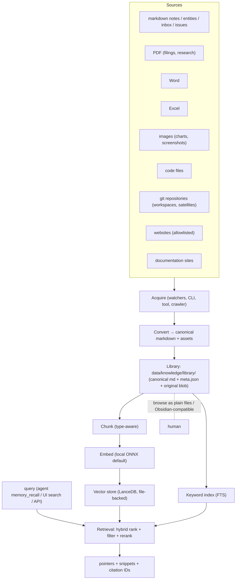
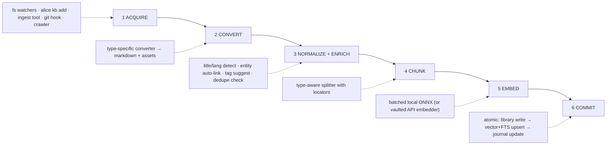
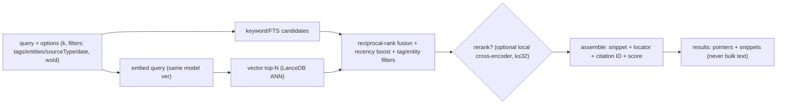
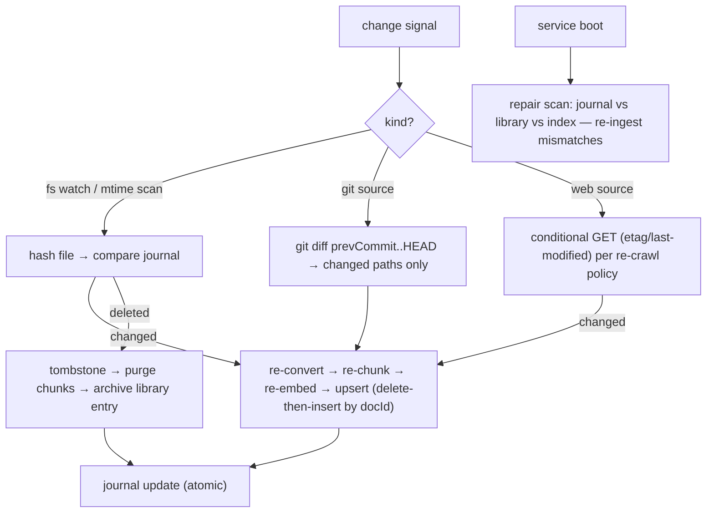

# Knowledge Management System Design

**Status: design document — not implemented.** A planning surface like
[[docs/roadmap.md]]; current code overrides this prose. This is the deep-dive
for the Memory plane sketched in [[docs/ai-os-design.md]] § 7, and it consumes
roadmap IDs ME-1/ME-2/ME-3/ME-6, KB-1/KB-2/KB-5.

---

## 1. Goals and Non-Goals

**Goal.** Every artifact a trading-research operation touches — notes, filings
(PDF), spreadsheets, charts/images, code, whole git repos, websites, and vendor
docs — becomes durable, searchable, citable knowledge that agents recall
semantically and humans browse as ordinary files.

**Non-goals.** Not a cloud RAG SaaS (local-first is the point). Not a
replacement for the entity store — entities remain the curated *graph*; this
system is the *corpus + recall* layer beneath and around it. Not a crawler of
the open web — website ingestion is allowlisted, user-initiated.

### Design principles

1. **Files are truth, the index is derived.** Everything a user or agent can
   cite lives as an inspectable file under `OPENALICE_HOME`. The vector index
   is a cache: deletable, rebuildable, never authoritative. This one decision
   makes versioning, migration, backup, and disaster recovery trivial —
   `data/` remains the portable unit ([[docs/project-structure.md]]).
2. **One canonical form.** Every source type normalizes to *canonical
   markdown + sidecar metadata + preserved original blob*. Converters vary;
   everything downstream (chunking, embedding, retrieval, citation, UI) is
   uniform.
3. **Provenance is load-bearing.** Every chunk knows its source, version, and
   in-document locator. Citations (KB-5) are resolvable IDs, not prose.
4. **Local by default.** Embedding and OCR run on-device; a cloud embedder is
   an explicit opt-in through the existing credential vault, never a default.
5. **Owned by the Memory service** (`:47334`, Guardian-supervised, optional).
   Alice degrades to substring search when it is absent — same
   optional-carrier pattern as UTA.

---

## 2. System Overview



The **entity store stays the graph of record**: documents link *to* entities
(`[[wikilinks]]` + `entities:` metadata), and entity pages gain a "sources"
view derived from those links (KB-2's news auto-linking generalized).

---

## 3. Content Model

### 3.1 Document record

Every ingested item is a **Document** with a stable `docId` (content-hash
prefixed by source class, e.g. `pdf_8f3a…`). On disk:

```text
<OPENALICE_HOME>/data/knowledge/
├── library/<docId>/
│   ├── content.md          canonical markdown (the citable text)
│   ├── meta.json           metadata (below)
│   ├── original.<ext>      preserved source blob (pdf/docx/xlsx/png/…)
│   └── assets/             extracted images / tables (referenced from content.md)
├── index/                  DERIVED — vector + FTS, safe to delete
│   ├── lance/              LanceDB dataset (chunks table)
│   └── journal.json        ingest journal: docId → {contentHash, embedderVer, chunkedAt}
├── sources.json            registered sources (git remotes, sites, watch dirs) + policies
└── tombstones.json         deleted docIds awaiting index purge
```

### 3.2 Metadata (`meta.json`)

```jsonc
{
  "docId": "pdf_8f3a12…",
  "sourceType": "pdf",                  // md | pdf | docx | xlsx | image | code | git | web | docs
  "origin": {                            // where it came from — citation root
    "kind": "file|git|url",
    "path": "…/NVDA-10K-2026.pdf",      // or repo+commit+path, or URL
    "retrievedAt": "2026-07-12T…",
    "version": "sha256:… | commit:abc123 | etag:…"
  },
  "title": "NVIDIA 10-K FY2026",
  "tags": ["filing", "10-K", "semis"],  // user + auto tags, flat namespace
  "entities": ["NVDA", "semiconductors"], // links into the entity store
  "lang": "en",
  "createdAt": "…", "updatedAt": "…",
  "supersedes": "pdf_11aa…",            // versioning chain (§ 7)
  "ingest": { "converter": "pdf@1", "ocr": false, "pages": 142 }
}
```

**Tagging** is deliberately simple: a flat string set, editable in UI and by
agents (gated tool), with auto-tagging suggestions from the enrichment step.
Hierarchies emerge from entities + wikilinks, not from a tag taxonomy.

### 3.3 Chunk record (index-side only)

`{ chunkId: "<docId>#<n>", docId, text, vector, locator, headings[], tags[],
entities[], tokens, contentHash, embedderVer }` — where **locator** is the
type-appropriate pointer: heading path (md), page+block (pdf), sheet+range
(xlsx), symbol+lines (code), URL fragment (web). Locators are what make
citations resolvable (§ 8).

---

## 4. Indexing Pipeline



### 4.1 Acquire

| Path | Mechanism |
|---|---|
| Notes/entities/inbox/issues | fs-watch on existing stores (they are already files) |
| Files (pdf/docx/xlsx/img/code) | `alice kb add <path>` CLI + `kb_ingest` workspace tool (gated for bulk) + drag-drop in UI |
| Git repositories | registered in `sources.json`; indexed at HEAD, updated per new commit (§ 6) |
| Websites/docs sites | registered URL + allowlist policy (same-origin, depth, robots-respecting); fetched via the managed browser (ai-os-design § 8) so JS sites render |

### 4.2 Convert (per source type)

| Type | Converter (recommended) | Output notes |
|---|---|---|
| Markdown | passthrough + frontmatter lift | wikilinks preserved |
| PDF | `pdfjs-dist` text layer; **OCR fallback** `tesseract.js` when text density is low | page/block locators; tables → markdown tables where detectable |
| Word | `mammoth` → HTML → `turndown` → md | styles dropped deliberately |
| Excel | `exceljs` → per-sheet markdown tables (+ CSV asset per sheet) | huge sheets: summarize + keep CSV asset as the citable original |
| Images | `tesseract.js` OCR + optional vision-caption via a vaulted credential (opt-in) | caption+OCR text is the citable proxy; original always preserved |
| Code | passthrough; language detected | chunking does the real work (§ 4.4) |
| Git repo | file-tree walk honoring `.gitignore` + kb-ignore globs; code+md+configs only | binary blobs skipped; `docId` per file, `origin.version = commit` |
| Website | readability extraction (`@mozilla/readability`) on rendered DOM | one Document per page; assets downloaded per policy |
| Docs sites | same + sitemap-guided crawl | section-per-page keeps chunks coherent |

All converters are a **registry keyed by mime/type** — adding a format is one
module + one registry entry (extension-friendly, PL-1-compatible later).

### 4.3 Normalize + enrich

Canonical markdown gets: title inference, language detect, near-duplicate check
(minhash over shingles — skip re-ingesting the same filing from two paths),
entity auto-linking (string+alias match against the entity store, suggestions
above a confidence threshold go to a review queue rather than auto-committing),
tag suggestions.

### 4.4 Chunk (type-aware, locator-preserving)

| Type | Strategy | Target size |
|---|---|---|
| Markdown/docs/web | heading-path splitter; merge tiny sections; overlap 1 sentence | 300–600 tokens |
| PDF | layout blocks within page; tables kept whole | 300–600 |
| Excel | row-groups per sheet with header row repeated | ≤ 400 |
| Code | **symbol-aware** via `tree-sitter` (function/class units, imports header chunk); fallback: indentation blocks | ≤ 500 |
| Images | one chunk (caption + OCR) | n/a |

Every chunk carries its heading path / symbol path in-text as a prefix line —
cheap contextualization that measurably improves retrieval without fancy
techniques.

### 4.5 Embed + commit

- Batched embedding through the Memory service's single embedder instance.
- **Commit is atomic per document**: write library files → upsert chunks
  (delete-then-insert by `docId`) → update `journal.json`. A crash mid-commit
  leaves a journal mismatch that the next scan repairs (§ 6).

---

## 5. Retrieval Pipeline



Consumers:

1. **`memory_recall`** (WorkspaceToolCenter — identity-aware): agents get top-k
   snippets + `alice://` citation IDs; they open the underlying file with
   native tools if they need more. Keeps context budgets sane (AI-8).
2. **`/api/knowledge/search`** for the UI: same ranking, plus facets
   (tags/types/entities) for browse.
3. **Entity pages**: "sources mentioning this entity" = a filtered retrieval,
   giving KB-2 for free across *all* content, not just news.

Hybrid-first is deliberate: pure vector search is weak on tickers, exact
numbers, and code identifiers — exactly this corpus. FTS carries exact-match;
vectors carry paraphrase; fusion beats either alone.

---

## 6. Incremental Indexing

The journal (`index/journal.json`) maps `docId → {contentHash, embedderVer,
chunkedAt}` and drives all incrementality:



Rules:

- **Change detection is content-hash, not mtime** (mtime is the trigger, hash
  is the decision) — editor touch-saves don't re-embed.
- **Git sources index commits, not working trees**: per new commit, only the
  diff's paths re-ingest; `origin.version` records the commit, which gives
  code citations pinned to an immutable ref.
- **Embedder version is part of the journal.** Changing the model does *not*
  force a stop-the-world re-embed: queries run against the old vectors
  (flagged `staleEmbedder`), and a background lane re-embeds
  least-recently-used-first until the index converges.
- **Deletions tombstone first, purge on the next compaction** (ME-6), so a
  citation to a just-deleted doc degrades to "archived" instead of a 404.
- **Full rebuild** (`alice kb rebuild`) drops `index/` and replays the library
  — the recovery story is one command because the index is derived (§ 1.1).

---

## 7. Versioning

Two complementary mechanisms, chosen by whether the file is *authored* or
*ingested*:

- **Authored knowledge (notes, entities, issues)** is already in git-shaped
  stores (workspaces) or migration-governed data dirs. Recommendation: an
  optional **vault repo** — `data/knowledge/library/` under its own local git,
  auto-committed by the Memory service on ingest batches. History, diffs, and
  rollback come free; no new machinery.
- **Ingested documents** are immutable per version: a re-ingested changed
  source produces a *new* `docId` with `supersedes: <oldDocId>`; the old entry
  stays (archived flag) so existing citations keep resolving. Retrieval
  defaults to latest-in-chain; `includeSuperseded: true` opts in.

Citations therefore never dangle: they resolve to the exact version cited,
with the UI offering "a newer version exists →".

---

## 8. Citations

The contract (KB-5) that makes agent output auditable:

- **ID form**: `alice://kb/<docId>#<chunkId>` — stable, resolvable by Alice's
  API and the UI to `{document, version, locator, snippet}`.
- **Locator rendering**: page 47 (pdf) · `Sheet2!B4:F12` (xlsx) ·
  `src/foo.ts:120-158 @ commit abc123` (git/code) · heading path (md/web) —
  plus the original URL/path for external verification.
- **Agent contract**: the researcher/report skills require a `sources:` block
  of citation IDs in `inbox_push` payloads; the Inbox UI renders them as
  provenance chips; reports without citations are visually flagged.
- **Round-trip**: `alice kb open <citation>` jumps a human (or agent, via
  `workspace_path`-style resolution) to the exact file+locator.

---

## 9. Technology Recommendations

| Concern | Recommend | Why | Alternative |
|---|---|---|---|
| Vector store | **LanceDB** (file-based, embedded, columnar) | zero-server, single-dir dataset fits the files-are-truth rule; native hybrid (vector+FTS) support; good Node bindings | `sqlite-vec` (simpler, one .db file) if LanceDB's native dep is unwanted — the store sits behind one interface either way |
| Embeddings | **bge-small-en-v1.5 / nomic-embed-text via onnxruntime-node** | local, fast on CPU, 384–768 dims keeps the index small | vaulted API embedder (OpenAI/Voyage) as opt-in for quality-sensitive corpora |
| Keyword index | LanceDB FTS (or SQLite FTS5 with sqlite-vec) | co-located with vectors, one commit path | — |
| Rerank (optional) | bge-reranker-base ONNX, k≤32 | measurable precision lift, still local | skip in v1 |
| PDF | `pdfjs-dist` + `tesseract.js` fallback | pure-JS, no system deps (Windows-friendly — a hard requirement here) | native pdfium if perf demands |
| Word / Excel | `mammoth` / `exceljs` | battle-tested, pure-JS | — |
| HTML extraction | `@mozilla/readability` + managed browser rendering | handles JS-heavy sites via the § 8 browser profile | `linkedom` for static pages |
| Code chunking | `tree-sitter` (wasm builds) | symbol-true chunks; wasm avoids native-build pain | regex/indent fallback ships anyway |
| Dedupe | minhash shingles | cheap, no model needed | — |
| Wire contract | new `packages/knowledge-protocol` | mirrors `uta-protocol`: schema-first, both sides typed | — |

All pure-JS/wasm-first choices are deliberate: this repo already carries the
scar tissue of native-dep pain on Windows (`node-pty`, pnpm artifacts).

---

## 10. Security and Limits

- **No default egress.** OCR, embedding, rerank run local. The only network
  paths are user-registered web sources (allowlisted, robots-respecting) and
  an explicitly-vaulted API embedder.
- **Ingestion is permission-shaped**: bulk `kb_ingest` and web-source
  registration are gated tools (Action Gate, ai-os-design § 9); passive
  watchers only cover OpenAlice's own stores.
- **Sealed at rest** applies: any embedder API key lives in the credential
  vault, never in `sources.json`.
- **Size honesty**: at bge-small dims, ~1M chunks ≈ a few GB — fine for a
  personal corpus. `alice kb stats` + retention/compaction (ME-6, IN-6) keep
  it bounded; giant git repos ingest with path filters, not wholesale.

---

## 11. Implementation Phases (when this leaves design)

1. **Core loop** — library layout, md/pdf converters, heading chunker, local
   embedder, LanceDB, `memory_recall`, journal-based incremental for fs
   sources. *(ME-1/ME-2 — the § 13 step-4 slice of the AI-OS plan)*
2. **Types breadth** — docx/xlsx/images/code converters, tree-sitter chunking,
   git-source indexing.
3. **Citations end-to-end** — `alice://kb/` resolution, Inbox provenance chips,
   researcher-skill contract. *(KB-5)*
4. **Web/docs ingestion** — managed-browser fetch, readability, re-crawl
   policies. *(KB-1)*
5. **Quality layer** — reranker, entity auto-link review queue, dedupe,
   vault-repo versioning, compaction jobs. *(ME-6, KB-2)*

Each phase lands with migrations for new state dirs, an update to
[[docs/project-structure.md]]'s state layout, and its own spec/smoke coverage
per [[AGENTS.md]].
