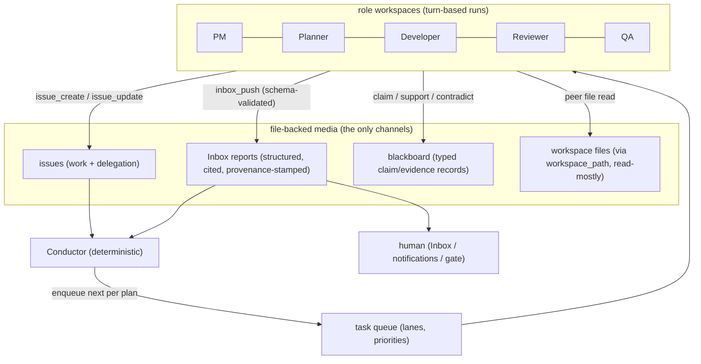
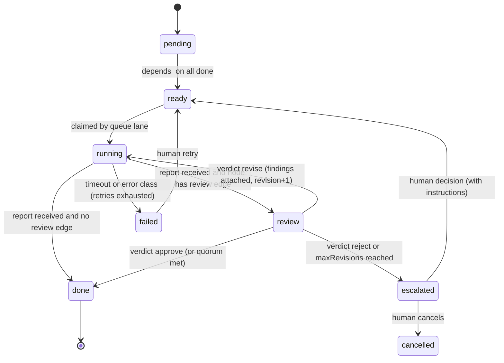
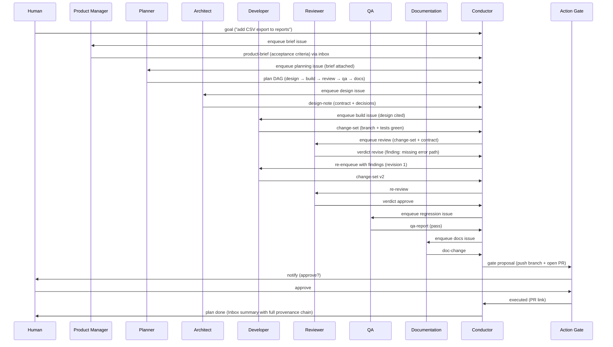
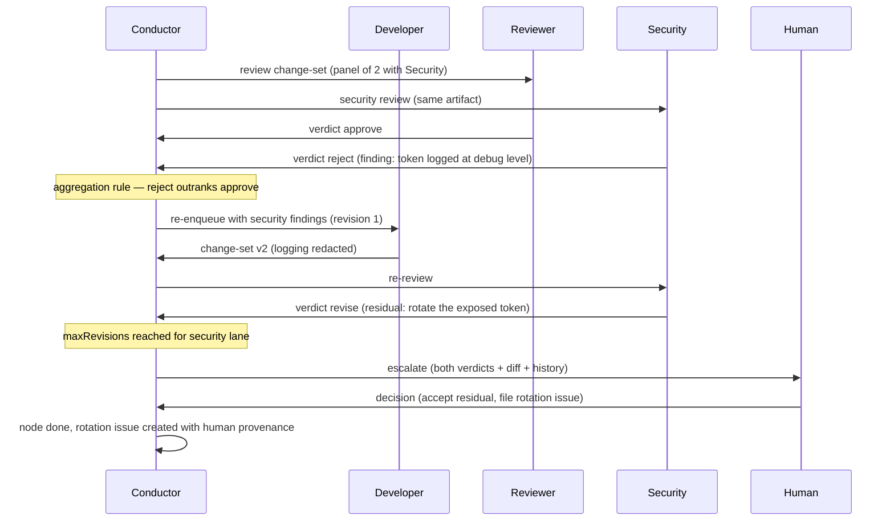
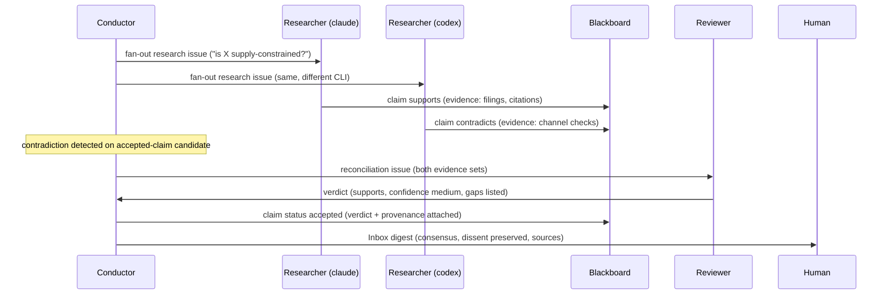

# Collaborative Multi-Agent Framework Design

**Status: design document — not implemented.** A planning surface like
[[docs/roadmap.md]]; current code overrides this prose. Builds on
[[docs/ai-os-design.md]] (queue § 5, roles § 6, Action Gate § 9) and
[[docs/knowledge-system.md]] (shared memory, citations). Consumes roadmap IDs
MA-1…MA-6, AI-2, AG-1/AG-5/AG-6, AU-3/AU-5.

---

## 1. Design Principles

1. **An agent is a role-workspace, not a thread.** Each agent = a Workspace
   (directory + git + PTY/headless runs) shaped by a role template, skill
   bundle, tool-permission profile (AG-5), and provider-routing class
   (ai-os-design § 6.2). Agents are *turn-based processes that exit*, not
   resident daemons — invariant 1 (no in-process model loop) holds.
2. **Artifacts over messages.** Agents never open sockets to each other. All
   communication is durable, inspectable files: issues, structured Inbox
   reports, blackboard records, and workspace files. If two agents "talked"
   and no file changed, nothing happened.
3. **Judgment in agents, control flow in code.** The orchestration engine
   (§ 9, "the Conductor") is a deterministic state machine over the task
   queue. It never calls a model. Agents decide *what is true and what to
   build*; the Conductor decides *what runs next*.
4. **The human is a first-class node.** Approval gates, escalations, and
   tie-breaks route to the user through the Inbox/notification/gate surfaces —
   the framework degrades to "supervised" rather than inventing autonomous
   authority.
5. **Every hop is provenance-stamped.** Identity is server-side (the existing
   identity-by-URL pattern): reports and delegations carry `wsId`/`runId`
   origins injected by Alice, never self-asserted by the agent.

---

## 2. Agent Catalog

Roles are shipped templates — adding one is template + skills + profile, zero
engine change. Routing classes per ai-os-design § 6.2 (`deep`/`cheap`).

| Agent | Responsibilities | Tool profile (beyond base issue/inbox) | Routing | Primary outputs (contract) |
|---|---|---|---|---|
| **Product Manager** | goal intake, scope cuts, acceptance criteria, priority calls | KB read, entity write | deep | `product-brief` (goals, non-goals, acceptance criteria) |
| **Planner** | decompose briefs into plans: issues, dependencies, role assignment, schedules | project/issue write | deep | `plan` (issue DAG + milestones) |
| **Architect** | system design, interface contracts, invariant guardianship | KB read, repo read | deep | `design-note` (decisions, contracts, rejected alternatives) |
| **Researcher** | evidence gathering, market/tech investigation, citation discipline | market/news/KB, browser, entity write | deep | `research-report` (findings + `sources:` citations) |
| **Developer** | implementation in a target repo, tests-first, small diffs | git write (own workspace), repo tools | deep | `change-set` (branch + diff summary + test results) |
| **Reviewer** | adversarial review of any artifact against its contract | read-only + verdict write | deep | `verdict` (approve / revise / reject + findings) |
| **QA** | test plans, regression execution, repro cases | repo read, test runners (shell profile) | cheap→deep | `qa-report` (pass/fail matrix, repro steps) |
| **Security** | threat review of diffs/designs, secret/injection scanning | read-only repo, KB | deep | `security-verdict` (findings by severity) |
| **Performance** | budgets, profiling analysis, regression flags | repo read, metrics read (IN-1) | cheap | `perf-report` (numbers vs budget) |
| **Documentation** | owner-guide updates, drift detection, changelogs | fs read, docs write (gated to docs paths) | cheap | `doc-change` (diff + affected guides) |
| **DevOps** | CI/CD tending, release steps, environment fixes | repo read, gated deploy/release tools | deep | `ops-report` (actions taken / proposed via gate) |

Every output type is a **structured Inbox payload** (AI-2 schema per type) —
this is what makes verdicts machine-readable and the Conductor deterministic.

---

## 3. Communication Model

Channel semantics:

- **Issues** = work requests. The universal envelope: role, inputs (citation
  IDs, artifact refs), `depends_on`, acceptance contract, deadline.
- **Inbox reports** = results. Schema per output type; `sources:` citations
  required by role skills; origin stamped server-side.
- **Blackboard** = shared beliefs (MA-3): typed entity records
  `{claim, evidence[], confidence, author, stance}` that multiple agents
  append to. This is where *debate* lives, decoupled from any single task.
- **Peer files** = bulk context. An agent reads (not writes) a peer workspace
  via the existing `workspace_path` resolution; writes to a peer's workspace
  are forbidden by profile — changes travel as issues or diffs.

---

## 4. Memory Sharing

Three tiers, enforced by tool-permission profiles:

| Tier | Backing | Who reads | Who writes |
|---|---|---|---|
| **Private** | the agent's workspace files + scratchpad | owner agent | owner agent |
| **Shared knowledge** | entity graph + KB corpus (`memory_recall`, citations) | all roles | curated writes: Researcher/PM (entities), all via review queue for auto-links |
| **Blackboard** | typed claim records (entity-store extension) | all roles | any role may add claims/evidence *with stance*, never edit others' |

Rules that keep shared memory trustworthy:

- Writes to shared tiers carry provenance + citations; uncited claims are
  flagged and rank lower in recall.
- Recall is snippets + pointers (knowledge-system § 5) — agents pull detail
  through files, keeping context budgets bounded (AI-8).
- The blackboard is append-only per author: consensus is computed from
  stances (§ 6), not from edits.

---

## 5. Delegation

Delegation is **issue creation with provenance** (MA-2) — no new primitive:

1. Any agent with `issue.write` may create an issue targeting a role
   (`role: reviewer`) or an explicit workspace; the Conductor resolves role →
   workspace (creating one from the role template if absent).
2. The child issue records `delegatedBy: {wsId, runId, issueRef}`; the parent
   issue gains `blockedBy: [child]` automatically when the delegator asks for
   a result (vs fire-and-forget).
3. **Fan-out** (MA-4): an issue may declare `matrix:` inputs (e.g. tickers,
   modules); the Conductor expands it into N parameterized child issues in a
   parallel lane and synthesizes an aggregation issue gated on all children.
4. Delegation depth and fan-out width are capped by config (default depth 3,
   width 16) — runaway recursive decomposition is structurally impossible.

The Planner is just the *heaviest user* of delegation; the mechanism is
uniform for every role.

---

## 6. Conflict Resolution

Conflicts are data, not exceptions. Three layers, escalating:

1. **Verdict loop (pairwise).** Producer ↔ Reviewer disagreement is bounded:
   `revise` verdicts re-enqueue the producer with findings attached; after
   `maxRevisions` (default 2) without `approve`, the Conductor escalates to a
   human decision item in the Inbox. No infinite ping-pong by construction.
2. **Panel (N-of-M).** For declared-critical artifacts, the plan requests
   multiple reviewers (optionally across CLIs — MA-6, where model
   disagreement itself is signal). Deterministic aggregation: `reject` wins
   over `revise` wins over `approve` unless ≥ quorum approve; ties escalate.
3. **Blackboard contradiction.** When a new claim carries
   `stance: contradicts` against an accepted claim, the Conductor opens a
   *reconciliation issue* assigned to a Reviewer with both evidence sets; its
   verdict updates claim status (`accepted / disputed / retired`). Standing
   knowledge conflicts therefore converge instead of accumulating.

Deterministic tie-break order everywhere: severity (security > correctness >
style) → quorum → human. The human is always the terminal arbiter; the
framework never auto-overrides an explicit human decision.

---

## 7. Task Scheduling

Scheduling reuses the queue design wholesale (ai-os-design § 5); multi-agent
adds only *plan-awareness*:

- **Readiness**: an issue enqueues when `depends_on` are `done` and its role's
  lane has capacity. Per-workspace serial lanes prevent self-competing runs;
  fan-out children ride a named parallel lane (AU-5).
- **Priority**: human-initiated > reviewer/verdict follow-ups > plan-critical
  path > background research > docs. The Conductor computes critical-path
  membership from the DAG, so unblocking work jumps the line.
- **Deadlines & staleness**: issues may carry `due:`; approaching deadlines
  raise priority one band and notify; stale `running` beyond timeout follows
  AG-2 (kill, classify, retry per AG-3).
- **Budget-aware**: router budgets (AI-3) degrade non-critical-path work from
  `deep` to `cheap` before pausing the plan — graceful brown-out, loudly
  reported.

---

## 8. Approval Workflow

Two gates, already designed, composed here:

- **Action Gate** (ai-os-design § 9) for irreversible side-effects (remote
  push, publish, deploy, spend). Role profiles declare which tools are gated;
  DevOps and Documentation are the heaviest users. Auto-approve allowlists
  (e.g. "push to my own repos' non-default branches") keep friction sane.
- **Plan-level approvals**: a plan node may be marked `approval: human` (ship
  it?) or `approval: committee` (MA-5: N-of-M mixed human+agent sign-off,
  recorded in the audit chain). The Conductor holds the node in `review`
  until the gate resolves; trading-adjacent plans inherit UTA's own gate
  untouched (invariant 2).

---

## 9. The Orchestration Engine ("Conductor")

A deterministic plan-runner inside Alice — **code, not a model**. It owns no
judgment: every decision it makes is a table lookup over structured verdicts
and outcome classes (AG-6).

**Plan** = a project (`ai-os-design` § 11) whose issues form a DAG with role
assignments, review edges, gates, and matrix expansions. Stored as markdown +
frontmatter; the Conductor's state lives beside the queue files (crash-safe,
migration-governed).

Node lifecycle:

Advancement rules (exhaustive by construction):

| Event | Conductor action |
|---|---|
| Report arrives, schema-valid | attach artifact, transition per review edge |
| Report invalid / missing | classify failed, retry per AG-3, then escalate |
| Verdict `revise` | re-enqueue producer with findings as issue comment |
| Quorum computed | aggregate per § 6 rules |
| Gate resolved | resume held node |
| Matrix node ready | expand children, create aggregation node |
| Any cap hit (depth/width/revisions/budget) | escalate, never improvise |

The Conductor is intentionally boring: ~"cron + state machine + file
journal". All intelligence stays in the role templates and skills, which is
what keeps the framework inside invariants 1 and 3.

---

## 10. Sequence Diagrams

### 10.1 Feature delivery pipeline (happy path with one revision)

### 10.2 Review conflict escalating to human

### 10.3 Research consensus via blackboard and committee

---

## 11. Failure Modes and Safeguards

| Risk | Safeguard |
|---|---|
| Infinite revise loops | `maxRevisions` cap → escalate (§ 6) |
| Runaway decomposition | delegation depth/width caps (§ 5) |
| Zombie/stuck runs | queue heartbeat timeout + retry classes (AG-2/AG-3) |
| Token/cost blowout | router budgets degrade then pause, loudly (AI-3) |
| Authority creep | tool profiles per role + Action Gate + audit chain |
| Fabricated consensus | citations required, uncited claims down-ranked, dissent preserved on blackboard |
| Orchestrator "cleverness" | Conductor is table-driven code, reviewed like any code — never a model |
| Cross-agent identity spoofing | provenance stamped server-side (existing identity-by-URL pattern) |

---

## 12. Implementation Phases

1. **Contracts first**: structured output schemas per role (AI-2), role
   templates + permission profiles (AG-1/AG-5), outcome classes (AG-6).
2. **Pairwise loop**: Conductor v1 = single review edge (producer→reviewer)
   over the queue (MA-1) — already useful daily.
3. **Delegation + fan-out**: `issue_create` handoff with provenance (MA-2),
   matrix expansion + aggregation (MA-4), caps.
4. **Blackboard + reconciliation** (MA-3) and cross-CLI ensembles (MA-6).
5. **Committee approvals** (MA-5) riding the Action Gate and audit chain.
6. **Full plan DAGs** with the PM/Planner front-end (ai-os-design § 11).

Each phase is independently valuable, lands with migrations + specs per
[[AGENTS.md]], and never introduces a resident agent process — the framework
is, from first commit to last, *turn-based agents over a deterministic file
substrate*.
