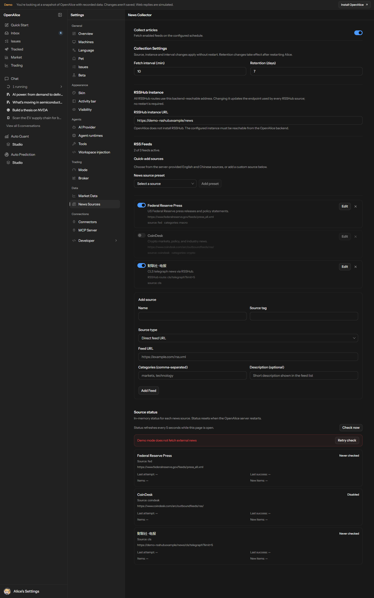

# 新闻源清单

<!-- Generated by scripts/generate-news-sources.ts. Edit the server catalog, then regenerate. -->

供用户和维护者查看内置来源、选择订阅。当前目录共 **31 个来源**，其中 **28 个直连源**、**3 个 RSSHub 来源**。

这是一张可选来源目录，不是当前用户订阅表，也不是全部来源可用的承诺。新配置初始状态只描述未提供自定义 feeds 时的默认列表；目录中的按需添加项不会自动订阅，生成清单也不会读取或修改用户配置。

## 来源表

| 名称 | 接入方式 | source 标签 | URL / 相对路由 | 分类 | 新配置初始状态 |
|---|---|---|---|---|---|
| Federal Reserve Press | RSS / Atom 直连 | fed | https://www.federalreserve.gov/feeds/press_all.xml | macro | 初始启用 |
| ECB Press | RSS / Atom 直连 | ecb | https://www.ecb.europa.eu/rss/press.html | macro | 初始启用 |
| MarketWatch Top Stories | RSS / Atom 直连 | marketwatch | http://feeds.marketwatch.com/marketwatch/topstories/ | markets, us | 初始启用 |
| WSJ Markets | RSS / Atom 直连 | wsj-markets | https://feeds.a.dj.com/rss/RSSMarketsMain.xml | markets, us | 初始启用 |
| CNBC Economy | RSS / Atom 直连 | cnbc-economy | https://search.cnbc.com/rs/search/combinedcms/view.xml?partnerId=wrss01&id=20910258 | macro, markets | 初始启用 |
| MarketWatch Real-time | RSS / Atom 直连 | marketwatch-pulse | http://feeds.marketwatch.com/marketwatch/marketpulse/ | markets, us | 初始停用 |
| Yahoo Finance | RSS / Atom 直连 | yahoo-finance | https://finance.yahoo.com/news/rssindex | markets, us | 初始停用 |
| Seeking Alpha | RSS / Atom 直连 | seekingalpha | https://seekingalpha.com/feed.xml | markets, us | 初始停用 |
| WSJ Business | RSS / Atom 直连 | wsj-business | https://feeds.a.dj.com/rss/RSSWSJD.xml | markets, us | 初始停用 |
| WSJ World News | RSS / Atom 直连 | wsj-world | https://feeds.a.dj.com/rss/RSSWorldNews.xml | news, world | 初始停用 |
| NYT Business | RSS / Atom 直连 | nyt-business | https://rss.nytimes.com/services/xml/rss/nyt/Business.xml | markets, us | 初始停用 |
| NYT Economy | RSS / Atom 直连 | nyt-economy | https://rss.nytimes.com/services/xml/rss/nyt/Economy.xml | macro, us | 初始停用 |
| FT Home | RSS / Atom 直连 | ft | https://www.ft.com/rss/home | markets, world | 初始停用 |
| The Economist Finance | RSS / Atom 直连 | economist-finance | https://www.economist.com/finance-and-economics/rss.xml | macro, markets | 初始停用 |
| CNBC Finance | RSS / Atom 直连 | cnbc | https://search.cnbc.com/rs/search/combinedcms/view.xml?partnerId=wrss01&id=10000664 | markets, us | 初始停用 |
| CNBC Top News | RSS / Atom 直连 | cnbc-top | https://search.cnbc.com/rs/search/combinedcms/view.xml?partnerId=wrss01&id=100003114 | news | 初始停用 |
| CNBC Markets | RSS / Atom 直连 | cnbc-markets | https://search.cnbc.com/rs/search/combinedcms/view.xml?partnerId=wrss01&id=15839069 | markets, us | 初始停用 |
| TechCrunch | RSS / Atom 直连 | techcrunch | https://techcrunch.com/feed/ | tech | 初始停用 |
| The Verge | RSS / Atom 直连 | theverge | https://www.theverge.com/rss/index.xml | tech | 初始停用 |
| Ars Technica | RSS / Atom 直连 | arstechnica | https://feeds.arstechnica.com/arstechnica/index | tech | 初始停用 |
| Nikkei Asia | RSS / Atom 直连 | nikkei-asia | https://asia.nikkei.com/rss/feed/nar | markets, asia | 初始启用 |
| SCMP Business | RSS / Atom 直连 | scmp-business | https://www.scmp.com/rss/91/feed | markets, asia | 初始启用 |
| SCMP Economy | RSS / Atom 直连 | scmp-economy | https://www.scmp.com/rss/92/feed | macro, asia | 初始停用 |
| CoinDesk | RSS / Atom 直连 | coindesk | https://www.coindesk.com/arc/outboundfeeds/rss/ | crypto | 初始启用 |
| CoinTelegraph | RSS / Atom 直连 | cointelegraph | https://cointelegraph.com/rss | crypto | 初始停用 |
| The Block | RSS / Atom 直连 | theblock | https://www.theblock.co/rss.xml | crypto | 初始停用 |
| Bitcoin Magazine | RSS / Atom 直连 | bitcoinmagazine | https://bitcoinmagazine.com/feed | crypto | 初始停用 |
| Decrypt | RSS / Atom 直连 | decrypt | https://decrypt.co/feed | crypto | 初始停用 |
| 财联社 · 电报 | RSSHub | cls | cls/telegraph | — | 按需添加 |
| 格隆汇 · 实时快讯 | RSSHub | gelonghui | gelonghui/live | — | 按需添加 |
| 金十数据 · 市场快讯 | RSSHub | jin10 | jin10 | — | 按需添加 |

RSSHub 路由使用设置页的共享实例地址；切换实例只影响 RSSHub 来源，不改变普通直连 URL。RSSHub 是用户自行提供、可从 Alice 后端访问的外部服务；OpenAlice 不安装或托管它。

## 使用与兼容

- 在 Settings → News Sources 中显式添加目录项，也可添加或编辑自定义直连源与 RSSHub 路由。查看目录不会改写现有订阅。
- 保存后来源、启停、间隔、共享实例地址与内存策略应用到运行中的单一采集器；在途采集先结束，再使用新配置。减小内存窗口不删除持久归档。
- 旧配置中的完整 URL 保持原样，即使它指向 RSSHub；只有明确设为 RSSHub 相对路由的订阅才跟随共享实例地址。可通过编辑来源、显式选择 RSSHub 类型来转换，不自动迁移或替换订阅。
- 社区非 RSS producer 的导入、代码批准、版本选定、订阅及故障重试见[模块设计与操作契约](news-modules/sdd.md)。模块以后台 OS 用户权限运行，不是沙箱；批准模块等于信任其文件、网络、子进程和同用户数据访问能力，失控模块可能耗尽后台内存。
- RSSHub 服务 key 通过独立后台接口密封存储；不要填入普通 URL 或 RSSHub 路由。显式 RSSHub route 的 key/code 不存入普通配置；普通 direct RSS URL 的查询语义保持原样。密封保护落盘，不阻止同一 OS 用户获准模块访问该密钥。更换有 key 的实例先清除、改基址、重录。非 loopback 须 HTTPS；源站 Cookie/Token 由 RSSHub 运营者维护。

## 可用性边界

- 清单生成不联网；收录和初始启用均不代表验证通过，公共实例与自建实例的可用性可能不同。
- 当前订阅、启用状态和采集健康度，以 Settings → News Sources 中的用户配置和 Source status 为准。状态与最近成功、失败信息仅保存在进程内，重启后重新采集，不是历史可用性记录。
- 健康记录按订阅 ID（包括旧配置未提供 ID）、source 标签及实际请求 URL 识别；只改名称、分类或采集间隔会保留记录，改变来源身份则重置。无法区分的重复旧订阅在重新配置时重置，不借用另一行的成功记录。
- HTTP 200 不等于健康：响应须具有受支持的 RSS / Atom 外层结构，RSS / RDF 须包含直接子级 channel。合法空 feed 可以成功；这不是完整 XML 或 RFC 合规校验。
- 单次 RSS/Atom HTTP 响应最多读取 8 MiB；模块导入请求体在解析 JSON 前受限，单制品最多 8 MiB。超限拒绝，不把截断内容标为成功。

## 界面示例

下面是 Demo 模式的设置页：添加来源、编辑相对路由及修改共享实例地址后，直连 URL 保持不变。Demo 不联网采集，手动检查会明确拒绝，不把示例数据标记为已采集成功。

## 维护

[服务端来源目录](../src/domain/news/config.ts)是来源定义的唯一权威入口，也提供设置页的可选来源。新增、删除或修改内置来源后，从仓库根目录运行：

    pnpm exec tsx scripts/generate-news-sources.ts

把生成的表格随目录变更一同维护，不手改本文件的来源行，不另写一份前端预设列表。运行此命令不联网、不启动 collector，不采集新闻。
